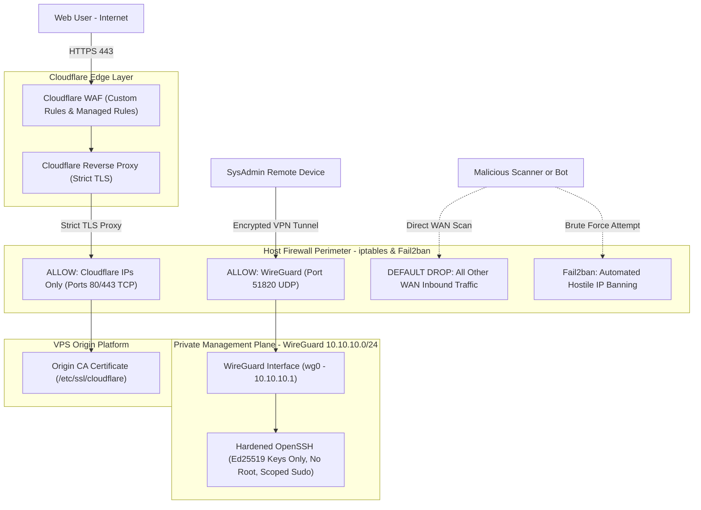

# zero-trust-vps-platform
### *Cloudflare Edge, Zero-Trust Perimeter, WireGuard S2C, Host Firewall & Hardened Administration*

[](#)
[](#)
[](#)
[](#)

---

## High-Level Perimeter Architecture Diagram



---

## Engineering Case Studies (S.T.A.R. Format)

Each case documents engineering decisions and trade-offs behind this platform following the **Situation, Task, Action, Result** methodology.

| Case | Focus Area | Key Technologies | Status |
| :--- | :--- | :--- | :---: |
| **[Case 01](./cases/case-01-perimeter-foundation-and-zero-trust-admin/00-overview.md)** | VPS Perimeter Foundation & Zero-Trust Administration | Cloudflare Proxy & WAF, WireGuard, iptables, Fail2ban, SSH Hardening | 🟢 Published |

---

## Repository Structure

```text
.
├── README.md                          # High-level architecture & case index
└── cases/
    └── case-01-perimeter-foundation-and-zero-trust-admin/
        ├── 00-overview.md             # S.T.A.R. breakdown, architecture & phase index
        ├── 01-identity-dns.md         # Phase 1: Ed25519 identity, OS baseline & DNS delegation
        ├── 02-ssh-vpn-hardening.md    # Phase 2: OpenSSH hardening, sudo scoping & WireGuard S2C
        ├── 03-firewall-monitoring.md  # Phase 3: iptables Default-DROP firewall & Fail2ban
        ├── 04-cloudflare-tls.md       # Phase 4: Cloudflare Proxy, Origin CA & Full (Strict) SSL
        └── 05-cloudflare-waf.md       # Phase 5: Cloudflare WAF Custom Rules & Edge Security
```
