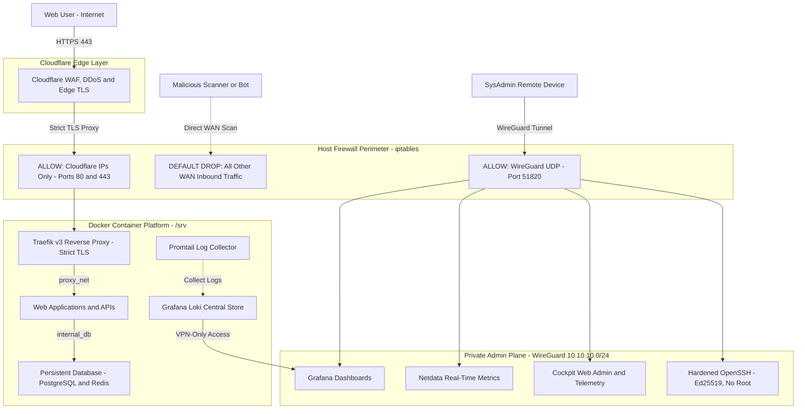

# zero-trust-vps-platform
### *Zero-Trust Perimeter, Cloudflare Edge, Reverse Proxy, Container Isolation & Centralized Observability*

[](#)
[](#)
[](#)
[](#)
[](#)
[](#)
[](#)

---

## High-Level Architecture Diagram



---

## Engineering Case Studies (S.T.A.R. Format)

Each case documents engineering decisions and trade-offs behind this platform following the **Situation, Task, Action, Result** methodology.

| Case | Focus Area | Key Technologies | Status |
| :--- | :--- | :--- | :---: |
| **[Case 01](./cases/case-01-perimeter-foundation-and-zero-trust-admin/00-overview.md)** | VPS Perimeter Foundation & Zero-Trust Administration | Cloudflare Proxy, WireGuard, iptables, Fail2ban, SSH Hardening | 🟢 Published |
| **Case 02** | Edge Ingress, WAF Rules & Traefik v3 Reverse Proxy | Cloudflare WAF, Traefik v3, Origin CA, Strict TLS | 🟡 Planned |
| **Case 03** | Container Platform Hardening & Network Isolation | Docker CE, Non-Root Containers, Isolated DB Bridge | 🟡 Planned |
| **Case 04** | Centralized Observability & Telemetry Stack | Grafana, Loki, Promtail, Netdata, Cockpit | 🟡 Planned |
| **Case 05** | Automated Encrypted Backups & Disaster Recovery | Restic, Systemd Timers, Remote Object Storage | 🟡 Planned |

---

## Repository Structure

```text
├── cases/
│   └── case-01-perimeter-foundation-and-zero-trust-admin/
│       ├── 00-overview.md             # S.T.A.R. breakdown, architecture & phase index
│       ├── 01-identity-dns.md         # Phase 1: Ed25519 identity, OS baseline & DNS delegation
│       ├── 02-ssh-vpn-hardening.md    # Phase 2: OpenSSH hardening, sudo scoping & WireGuard S2C
│       ├── 03-firewall-monitoring.md  # Phase 3: iptables Default-DROP firewall & Fail2ban
│       └── 04-cloudflare-tls.md       # Phase 4: Cloudflare Proxy, Origin CA & Full (Strict) SSL
└── docs/
    └── runbooks/
        └── 02-wireguard-s2c-vpn-setup.md # Operational runbook for WireGuard administration
```
