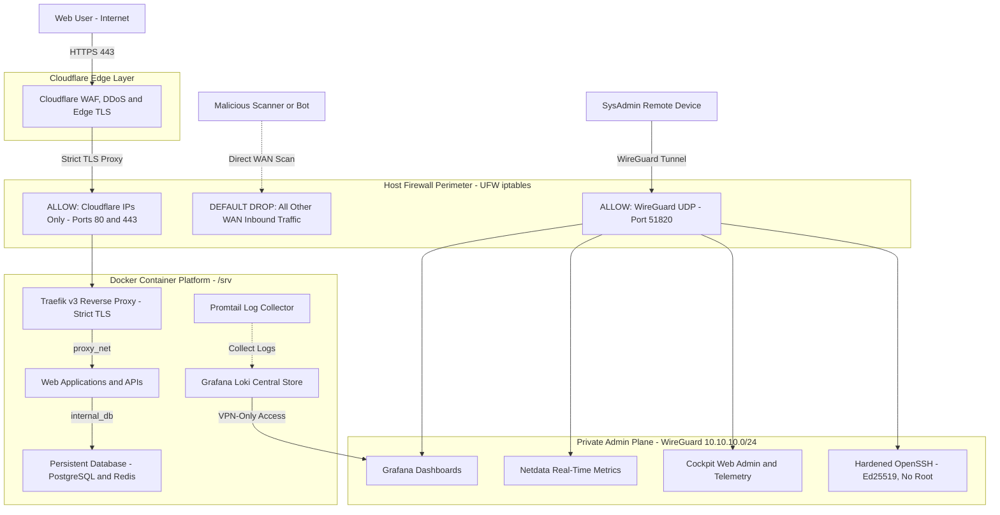

# zero-trust-vps-platform
### *Zero-Trust Perimeter, Cloudflare Edge, Reverse Proxy, Container Isolation & Centralized Observability*

---

## High-Level Architecture Diagram

---

## Engineering Case Studies (S.T.A.R. Format)

Each case below documents a real engineering decision behind this platform, following the **Situation, Task, Action, Result** format, the goal is to show *what* was deployed, *why* specific trade-offs were made and how they were validated.

| Case | Focus Area | Key Technologies | Status |
| :--- | :--- | :--- | :---: |
| **[Case 01](./cases/case-01-perimeter-and-edge-security.md)** | Perimeter Hardening, Edge Security & Zero-Trust Admin | Cloudflare WAF, WireGuard, UFW/iptables, SSH Hardening | 🟢 Published |
| *More cases coming soon* | — | — | 🟡 Planned |

---

## Security Posture & Defense-in-Depth Matrix

| Layer | Threat Vector | Implemented Defense & Controls | Validation Method |
| :--- | :--- | :--- | :--- |
| **Identity & Access** | SSH Password Brute-force & Credential Stuffing | Ed25519 asymmetric keys exclusively, PermitRootLogin no, PasswordAuthentication no, explicit AllowUsers whitelist. | `ssh -o PreferredAuthentications=password` fails instantly without password prompt. |
| **Network Perimeter** | Port Scanning & Direct Host Fingerprinting | Host firewall in **Default-DROP** mode. Port 22 blocked entirely from WAN; ports 80/443 restricted to Cloudflare CIDRs only. | Active nmap -sS -Pn -p- from non-Cloudflare IPs confirms no unintended TCP ports are open/responsive. |
| **Administrative Plane** | Unencrypted remote management & rogue admin probes | **WireGuard Site-to-Client VPN**. SSH & internal tools bind exclusively to the VPN interface (`10.10.10.x`). | Direct WAN connection to management ports times out; access succeeds exclusively when the WireGuard tunnel `wg0` is up. |
| **Edge / Web Ingress** | DDoS, Injections Attacks, Scrapers, Cloudflare Bypass | Cloudflare Proxy (Orange Cloud) + WAF rules + host firewall whitelist restricting 80/443 to Cloudflare CIDRs. | Direct `curl https://<VPS_IP>` times out/drops. Domain queries pass cleanly. |
| **Application Layer** | Container breakout & lateral network movement | Non-root containers, read-only root filesystem where applicable, segmented Docker bridge networks (`internal_db` isolated from gateway). | Compromised web container cannot reach other tenants or the DB network's gateway. |
| **Data & State** | Data loss & configuration drift | Atomic `/srv` directory mapping, named persistent volumes, snapshot baseline before changes. | Point-in-time rollback validated against snapshot baseline. |
