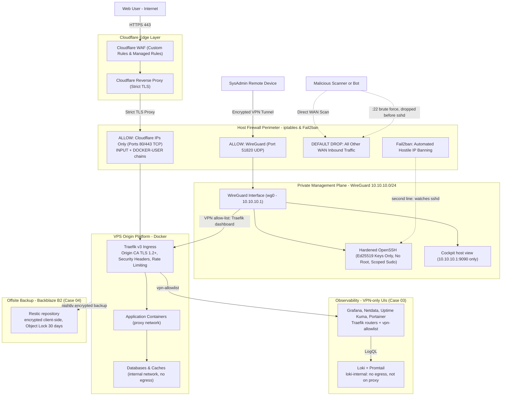

# zero-trust-vps-platform
### *Cloudflare Edge, Zero-Trust Perimeter, WireGuard S2C, Host Firewall, Segmented Container Platform, Traefik Ingress, VPN-only Observability & Tested Recovery*

[](#)
[](#)
[](#)
[](#)
[](#)
[](#)
[](#)
[](#)

---

## High-Level Architecture Diagram


```mermaid
graph TD
    User["Web User - Internet"]
    Attacker["Malicious Scanner or Bot"]
    Admin["SysAdmin Remote Device"]

    subgraph Cloudflare_Edge["Cloudflare Edge Layer"]
        CF_WAF["Cloudflare WAF (Custom Rules & Managed Rules)"]
        CF_PROXY["Cloudflare Reverse Proxy (Strict TLS)"]
        CF_WAF --> CF_PROXY
    end

    subgraph Host_Firewall["Host Firewall Perimeter - iptables & Fail2ban"]
        FW_CF["ALLOW: Cloudflare IPs Only (Ports 80/443 TCP)<br/>INPUT + DOCKER-USER chains"]
        FW_WG["ALLOW: WireGuard (Port 51820 UDP)"]
        FW_DROP["DEFAULT DROP: All Other WAN Inbound Traffic"]
        F2B["Fail2ban: Automated Hostile IP Banning"]
    end

    subgraph Admin_Plane["Private Management Plane - WireGuard 10.10.10.0/24"]
        WG_IF["WireGuard Interface (wg0 - 10.10.10.1)"]
        SSH["Hardened OpenSSH (Ed25519 Keys Only, No Root, Scoped Sudo)"]
        COCKPIT["Cockpit host view (10.10.10.1:9090 only)"]
        WG_IF --> SSH
        WG_IF --> COCKPIT
    end

    subgraph Origin_Layer["VPS Origin Platform - Docker"]
        TRAEFIK["Traefik v3 Ingress<br/>Origin CA TLS 1.2+, Security Headers, Rate Limiting"]
        APP["Application Containers (proxy network)"]
        DB["Databases & Caches (internal network, no egress)"]
        TRAEFIK --> APP --> DB
    end

    subgraph Observe_Layer["Observability - VPN-only UIs (Case 03)"]
        UIS["Grafana, Netdata, Uptime Kuma, Portainer<br/>Traefik routers + vpn-allowlist"]
        LOKI["Loki + Promtail<br/>loki-internal: no egress, not on proxy"]
        UIS -->|LogQL| LOKI
    end

    subgraph Offsite["Offsite Backup - Backblaze B2 (Case 04)"]
        B2["Restic repository<br/>encrypted client-side, Object Lock 30 days"]
    end

    User -->|HTTPS 443| CF_WAF
    CF_PROXY -->|Strict TLS Proxy| FW_CF
    FW_CF --> TRAEFIK

    Attacker -.->|Direct WAN Scan| FW_DROP
    Attacker -.->|":22 brute force, dropped before sshd"| FW_DROP
    F2B -.->|"second line: watches sshd"| SSH

    Admin -->|Encrypted VPN Tunnel| FW_WG
    FW_WG --> WG_IF
    WG_IF -->|VPN allow-list: Traefik dashboard| TRAEFIK
    TRAEFIK -->|vpn-allowlist| UIS
    Origin_Layer -.->|nightly encrypted backup| B2
```

---

## Controls mapping

This host is built as **defense in depth** with **Zero Trust administration**: the admin path is identity plus VPN, not a public SSH port. Case 02 carries the same model into the container platform: nothing is exposed unless it's explicitly declared. Case 03 applies it to the tools that watch the platform: every dashboard is part of the admin plane. Case 04 applies it to the backups: encrypted before they leave, stored with another provider and immutable for 30 days.

| Implemented | CIS Controls v8 | NIST CSF | Case |
| --- | --- | --- | :---: |
| Ed25519 SSH, no root, no password auth, scoped sudo | CSC 5–6 Account & Access Control | Protect | 01 |
| WireGuard S2C; SSH reachable only via `wg0` | CSC 12 Network Infrastructure | Protect | 01 |
| iptables Default-DROP; 80/443 only from Cloudflare IPs | CSC 12–13 Network Monitoring and Defense | Protect / Detect | 01 |
| Fail2ban | CSC 8 Audit Log Management, CSC 13 | Detect | 01 |
| Cloudflare Full (Strict) TLS + Origin CA | CSC 3 Data Protection | Protect | 01 |
| Cloudflare WAF, managed rules, rate limiting | CSC 9, CSC 13 | Protect / Detect | 01 |
| Hardened Docker daemon (`icc` off, `no-new-privileges`, log rotation, ulimits) | CSC 4 Secure Configuration | Protect | 02 |
| `DOCKER-USER` filter: published ports accept only Cloudflare on 80/443, fails closed | CSC 12–13 Network Infrastructure, Monitoring and Defense | Protect | 02 |
| Segmented Docker networks; internal networks without egress; no published DB ports | CSC 12 Network Infrastructure | Protect | 02 |
| Pinned images from official sources; changelog-gated change cycle with rollback | CSC 2 Software Inventory, CSC 7 Vulnerability Management | Identify / Protect | 02 |
| Traefik: Origin CA TLS 1.2+, HSTS and security headers, per-client rate limiting | CSC 3 Data Protection, CSC 16 Application Software Security | Protect | 02 |
| VPN-only admin routers (`ipAllowList`) and split-horizon dashboard | CSC 6 Access Control Management | Protect | 02 |
| JSON access logs with the real client IP | CSC 8 Audit Log Management | Detect | 02 |
| Bind-mounted state under `/srv/data`; snapshots before changes | CSC 11 Data Recovery | Recover | 02 |
| Every admin UI VPN-only: split-horizon DNS, `vpn-allowlist`, no published ports | CSC 6 Access Control Management, CSC 12 Network Infrastructure | Protect | 03 |
| Cockpit bound to the WireGuard address only (no public or IPv6 listener) | CSC 4 Secure Configuration, CSC 12 | Protect | 03 |
| Centralized logs: containers, journal (`sshd`, `sudo`, Fail2ban, kernel), Traefik access log | CSC 8 Audit Log Management | Detect | 03 |
| 7-day log retention with automatic deletion; Traefik log rotation | CSC 8 Audit Log Management | Detect | 03 |
| Log store isolated (internal network, no egress); non-root Loki and Grafana; file-based admin secret | CSC 4 Secure Configuration, CSC 12 | Protect | 03 |
| Security queries: admin logins, `sudo`, bans, VPN-allow-list `403`s, 5xx, 4xx sources | CSC 8, CSC 13 Network Monitoring and Defense | Detect | 03 |
| Per-second host and container metrics (Netdata) | — (operational monitoring) | Detect | 03 |
| End-to-end availability through Cloudflare; container health via the Docker API | — (operational monitoring) | Detect | 03 |
| Inventory of every Docker-socket consumer, with justification | CSC 2 Software Inventory, CSC 4 Secure Configuration | Identify | 03 |
| Nightly Restic backups, encrypted client-side, to another provider (B2); consistent copies of live databases | CSC 11 Data Recovery | Recover | 04 |
| B2 Object Lock (governance, 30 days); bucket-scoped key without `bypassGovernance` | CSC 11 Data Recovery, CSC 3 Data Protection | Protect / Recover | 04 |
| Repository password and key held off-server | CSC 11 Data Recovery | Recover | 04 |
| Retention policy and weekly integrity check (`restic check`) | CSC 11 Data Recovery | Recover | 04 |
| Backup heartbeat (Uptime Kuma push) and failure queries in Loki | CSC 8 Audit Log Management | Detect | 04 |
| Written restore runbooks and timed drills (rollback, app restore, full rebuild) | CSC 11 Data Recovery (11.5 Test Data Recovery) | Recover | 04 |

Governance and NIS2/RJC study notes live in [cybersecurity-officer](https://github.com/gabzaf/cybersecurity-officer), not in this repo.

---

## Engineering Case Studies (S.T.A.R. Format)

Each case documents engineering decisions and trade-offs behind this platform following the **Situation, Task, Action, Result** methodology.

| Case | Focus Area | Key Technologies | Status |
| :--- | :--- | :--- | :---: |
| **[Case 01](./cases/case-01-perimeter-foundation-and-zero-trust-admin/00-overview.md)** | VPS Perimeter Foundation & Zero-Trust Administration | Cloudflare Proxy & WAF, WireGuard, iptables, Fail2ban, SSH Hardening | 🟢 Published |
| **[Case 02](./cases/case-02-container-platform-and-traefik-ingress/00-overview.md)** | Segmented Container Platform & Traefik Ingress | Docker Engine, `DOCKER-USER` filtering, network segmentation, Traefik v3, Origin TLS | 🟢 Published |
| **[Case 03](./cases/case-03-observability-metrics-logs-availability/00-overview.md)** | VPN-only Observability: Metrics, Logs & Availability | Cockpit, Portainer, Netdata, Loki + Promtail + Grafana, Uptime Kuma | 🟡 In review |
| **[Case 04](./cases/case-04-backup-recovery-drills/00-overview.md)** | Immutable Backups & Timed Recovery Drills | Restic, Backblaze B2 Object Lock, systemd timers, restore runbooks, drills D1–D3 | 🟡 Drills pending |

---

## Repository Structure

```text
.
├── README.md                          # High-level architecture & case index
└── cases/
    ├── case-01-perimeter-foundation-and-zero-trust-admin/
    │   ├── 00-overview.md             # S.T.A.R. breakdown, architecture & phase index
    │   ├── 01-identity-dns.md         # Phase 1: Ed25519 identity, OS baseline & DNS delegation
    │   ├── 02-ssh-vpn-hardening.md    # Phase 2: OpenSSH hardening, sudo scoping & WireGuard S2C
    │   ├── 03-firewall-monitoring.md  # Phase 3: iptables Default-DROP firewall & Fail2ban
    │   ├── 04-cloudflare-tls.md       # Phase 4: Cloudflare Proxy, Origin CA & Full (Strict) SSL
    │   └── 05-cloudflare-waf.md       # Phase 5: Cloudflare WAF Custom Rules & Edge Security
    ├── case-02-container-platform-and-traefik-ingress/
    │   ├── 00-overview.md                  # S.T.A.R. breakdown, guiding principle & phase index
    │   ├── 01-srv-layout-docker-engine.md  # Phase 1: /srv production layout & hardened Docker Engine
    │   ├── 02-docker-firewall.md           # Phase 2: Published-port bypass & Cloudflare-only DOCKER-USER filter
    │   ├── 03-networks-state.md            # Phase 3: Network segmentation & bind-mounted persistent state
    │   ├── 04-health-change-cycle.md       # Phase 4: Healthchecks, restart policies & update/rollback cycle
    │   └── 05-traefik-ingress.md           # Phase 5: Traefik v3, Origin TLS, middlewares & VPN-only dashboard
    ├── case-03-observability-metrics-logs-availability/
    │   ├── 00-overview.md                     # S.T.A.R. breakdown, guiding principle & phase index
    │   ├── 01-observability-model-access.md   # Phase 1: Signals to watch & the VPN-only access pattern
    │   ├── 02-host-and-container-views.md     # Phase 2: Cockpit bound to wg0 & Portainer
    │   ├── 03-metrics-netdata.md              # Phase 3: Netdata host & container metrics
    │   ├── 04-centralized-logs.md             # Phase 4: Loki, Promtail & Grafana, retention & security queries
    │   ├── 05-availability-socket-review.md   # Phase 5: Uptime Kuma & Docker-socket review
    │   └── images/                            # Screenshots (sensitive data blurred)
    └── case-04-backup-recovery-drills/
        ├── 00-overview.md                  # S.T.A.R. breakdown, drill results & phase index
        ├── 01-recovery-model.md            # Phase 1: Failure modes, state inventory, RTO/RPO, snapshots vs backups
        ├── 02-restic-b2-backups.md         # Phase 2: B2 Object Lock, Restic, nightly job, retention & monitoring
        ├── 03-restore-runbooks.md          # Phase 3: Restoring a file, an app's data and a whole host
        └── 04-recovery-drills.md           # Phase 4: Timed drills D1-D3, results & open items
```
