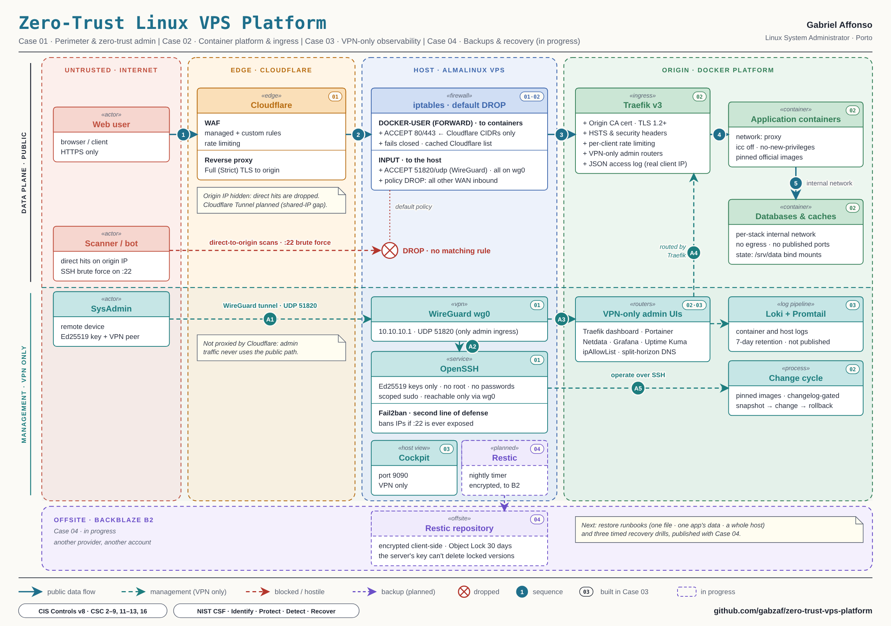

# zero-trust-vps-platform
### *Cloudflare Edge, Zero-Trust Perimeter, WireGuard S2C, Host Firewall, Segmented Container Platform, Traefik Ingress, VPN-only Observability & Tested Recovery*

[](#)
[](#)
[](#)
[](#)
[](#)
[](#)
[](#)
[](#)

---

## High-Level Architecture Diagram

<picture>
  <source media="(prefers-color-scheme: dark)" srcset="./docs/architecture/platform-dark.png">
  
</picture>

- **Public path**: visitor → Cloudflare WAF and Full (Strict) TLS → host firewall (`DOCKER-USER` accepts 80/443 only from Cloudflare) → Traefik → application containers; databases sit on per-stack internal networks.
- **Hostile traffic**: direct-to-origin scans and `:22` brute force are dropped before they reach any service; Fail2ban is the second line behind `sshd`.
- **Admin path**: WireGuard only → SSH, Cockpit and the VPN-only admin UIs (Traefik dashboard, Portainer, Netdata, Grafana, Uptime Kuma) behind `vpn-allowlist`.
- **Offsite**: nightly encrypted Restic backups to Backblaze B2 with Object Lock (Case 04, in progress).

Each component is tagged with the case that built it. The diagram is generated from code: see [`docs/architecture`](./docs/architecture/README.md).

---

## Engineering Case Studies (S.T.A.R. Format)

Each case documents engineering decisions and trade-offs behind this platform following the **Situation, Task, Action, Result** methodology.

| Case | Focus Area | Key Technologies | Status |
| :--- | :--- | :--- | :---: |
| **[Case 01](./cases/case-01-perimeter-foundation-and-zero-trust-admin/00-overview.md)** | VPS Perimeter Foundation & Zero-Trust Administration | Cloudflare Proxy & WAF, WireGuard, iptables, Fail2ban, SSH Hardening | 🟢 Published |
| **[Case 02](./cases/case-02-container-platform-and-traefik-ingress/00-overview.md)** | Segmented Container Platform & Traefik Ingress | Docker Engine, `DOCKER-USER` filtering, network segmentation, Traefik v3, Origin TLS | 🟢 Published |
| **[Case 03](./cases/case-03-observability-metrics-logs-availability/00-overview.md)** | VPN-only Observability: Metrics, Logs & Availability | Cockpit, Portainer, Netdata, Loki + Promtail + Grafana, Uptime Kuma | 🟡 In review |
| **[Case 04](./cases/case-04-backup-recovery-drills/00-overview.md)** | Immutable Backups & Timed Recovery Drills | Restic, Backblaze B2 Object Lock, systemd timers, restore runbooks, drills D1–D3 | 🟡 Drills pending |

---

## Security Controls

The platform is built as **defense in depth** with **Zero Trust administration**: the admin path is identity plus VPN, never a public port. Case 02 carries that into the container platform (nothing is exposed unless it's declared), Case 03 into the tools that watch it (every dashboard is part of the admin plane), and Case 04 into the backups (encrypted before they leave, immutable for 30 days).

| Case | Main CIS Controls v8 safeguards | NIST CSF 2.0 |
| :--- | :--- | :--- |
| **01** Perimeter & admin access | 4.4 firewall on servers · 4.7 default accounts · 5.4 admin privileges · 12.7 remote access over VPN · 3.10 encryption in transit · 13.10 application-layer filtering | PR.AA · PR.IR · PR.DS · DE.CM |
| **02** Container platform | 4.1 secure configuration · 4.4 · 12.2 secure network architecture · 13.4 filtering between segments · 2.1 software inventory · 16.7 hardened templates | PR.PS · PR.IR · ID.AM |
| **03** Observability | 8.2 collect audit logs · 8.9 centralize · 8.3 adequate storage · 12.7 | PR.PS · DE.CM · DE.AE |
| **04** Backups & recovery *(planned)* | 11.1–11.5 data recovery · 3.11 encryption at rest | PR.DS · RC.RP |

**Open gaps, with next steps:** MFA for administrative access (6.4, 6.5), 90-day log retention (8.10), security alerting (13.1), automated patching and vulnerability scanning (7.3–7.6), anti-malware (10.1).

**→ [Full mapping](./docs/controls-mapping.md)**: every control at safeguard level, where it's implemented, the test that verifies it, and every known gap.

---

## Repository Structure

```text
.
├── README.md                          # High-level architecture & case index
├── docs/
│   ├── controls-mapping.md            # CIS v8 / NIST CSF 2.0 mapping, evidence links & known gaps
│   └── architecture/                  # Diagram generator, SVG sources & dark/light PNGs
└── cases/
    ├── case-01-perimeter-foundation-and-zero-trust-admin/
    │   ├── 00-overview.md             # S.T.A.R. breakdown, architecture & phase index
    │   ├── 01-identity-dns.md         # Phase 1: Ed25519 identity, OS baseline & DNS delegation
    │   ├── 02-ssh-vpn-hardening.md    # Phase 2: OpenSSH hardening, sudo scoping & WireGuard S2C
    │   ├── 03-firewall-monitoring.md  # Phase 3: iptables Default-DROP firewall & Fail2ban
    │   ├── 04-cloudflare-tls.md       # Phase 4: Cloudflare Proxy, Origin CA & Full (Strict) SSL
    │   └── 05-cloudflare-waf.md       # Phase 5: Cloudflare WAF Custom Rules & Edge Security
    ├── case-02-container-platform-and-traefik-ingress/
    │   ├── 00-overview.md                  # S.T.A.R. breakdown, guiding principle & phase index
    │   ├── 01-srv-layout-docker-engine.md  # Phase 1: /srv production layout & hardened Docker Engine
    │   ├── 02-docker-firewall.md           # Phase 2: Published-port bypass & Cloudflare-only DOCKER-USER filter
    │   ├── 03-networks-state.md            # Phase 3: Network segmentation & bind-mounted persistent state
    │   ├── 04-health-change-cycle.md       # Phase 4: Healthchecks, restart policies & update/rollback cycle
    │   └── 05-traefik-ingress.md           # Phase 5: Traefik v3, Origin TLS, middlewares & VPN-only dashboard
    ├── case-03-observability-metrics-logs-availability/
    │   ├── 00-overview.md                     # S.T.A.R. breakdown, guiding principle & phase index
    │   ├── 01-observability-model-access.md   # Phase 1: Signals to watch & the VPN-only access pattern
    │   ├── 02-host-and-container-views.md     # Phase 2: Cockpit bound to wg0 & Portainer
    │   ├── 03-metrics-netdata.md              # Phase 3: Netdata host & container metrics
    │   ├── 04-centralized-logs.md             # Phase 4: Loki, Promtail & Grafana, retention & security queries
    │   ├── 05-availability-socket-review.md   # Phase 5: Uptime Kuma & Docker-socket review
    │   └── images/                            # Screenshots (sensitive data blurred)
    └── case-04-backup-recovery-drills/
        ├── 00-overview.md                  # S.T.A.R. breakdown, drill results & phase index
        ├── 01-recovery-model.md            # Phase 1: Failure modes, state inventory, RTO/RPO, snapshots vs backups
        ├── 02-restic-b2-backups.md         # Phase 2: B2 Object Lock, Restic, nightly job, retention & monitoring
        ├── 03-restore-runbooks.md          # Phase 3: Restoring a file, an app's data and a whole host
        └── 04-recovery-drills.md           # Phase 4: Timed drills D1-D3, results & open items
```
