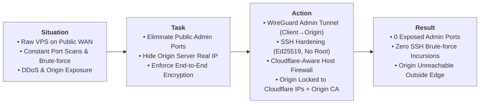

# Case 01: Perimeter Hardening, Edge Security & Zero-Trust Administration

> **Domain**: Infrastructure Security, Linux Administration, Network Hardening
>
> **Technologies**: Linux, Cloudflare Edge & WAF, WireGuard VPN, OpenSSH, UFW / iptables, Origin TLS 
>
> **Methodology**: S.T.A.R. Framework (Situation, Task, Action, Result)

## Executive Summary (S.T.A.R. Breakdown)

