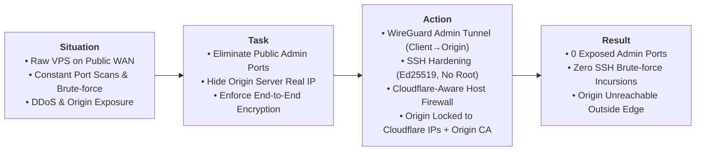

# Case 01: Perimeter Hardening, Edge Security & Zero-Trust Administration

> **Domain**: Infrastructure Security, Linux Administration, Network Hardening
>
> **Technologies**: Linux, Cloudflare Edge & WAF, WireGuard VPN, OpenSSH, UFW / iptables, Origin TLS 
>
> **Methodology**: S.T.A.R. Framework (Situation, Task, Action, Result)

## Executive Summary (S.T.A.R. Breakdown)



---

* **Situation**: Instantiating a cloud Linux self hosting VPS with a public IPv4 immediately exposes the machine to scanning engines and non-stop SSH brute-force campaigns.
* **Task**: Harden the host perimeter, eliminate exposed administrative attack surfaces from the public internet, ensure remote operations run exclusively through an encrypted private overlay and guarantee that **100% of public HTTP/S traffic is filtered by Cloudflare Edge (WAF/DDoS)** with zero possibility of direct-to-IP bypass attacks.
* **Action (Technical Implementation)**:
  1. **SSH Identity Hardening**: Disabled remote `root` login, disabled password authentication entirely, enforced asymmetric `Ed25519` key pairs and defined an explicit administrative user whitelist (`AllowUsers`).
  2. **Zero-Trust Administrative Overlay (WireGuard S2C)**: Deployed a **WireGuard** Site-to-Client VPN (UDP 51820). The OpenSSH daemon and telemetry endpoints were restricted to respond exclusively across the private VPN overlay subnet (`10.10.10.0/24`).
  3. **Cloudflare-Aware Host Firewall (Default-DROP)**: Configured host-level firewall rules (UFW / netfilter) enforcing an unconditional default-DROP policy on inbound WAN traffic. Ports 80 and 443 strictly authorize official Cloudflare CIDR blocks. Direct-to-IP connection attempts from unauthorized public sources are silently dropped at the packet filtering level.
  4. **Strict Cryptographic Ingress**: Installed Cloudflare Origin CA certificates on the origin reverse proxy and enabled **Full (Strict) SSL/TLS mode**, ensuring authenticated end-to-end encryption without risk of Man-in-the-Middle (MitM) interception.
  5. **Edge Threat Mitigation (WAF)**: Configured Cloudflare Web Application Firewall custom rules to challenge high threat-score requests, block known abusive ASNs, and rate-limit sensitive endpoints.
* **Result (Quantifiable Engineering Proof)**:
  * **Zero exposed administrative ports on WAN**: External port audits and scanners detect zero accessible management services.
  * **SSH brute-force attempts reduced to 0 on the host**: The SSH daemon receives zero packets from outside the WireGuard tunnel.
  * **Cloudflare bypass neutralization**: Direct TCP/HTTPS connections to the origin VPS IP address timeout immediately.

---

## Configuration Artifacts & Reference Code

### 1. Generate SSH Key Pair
To generate a modern, secure SSH key compatible with virtually any VPS provider, the recommended standard is **Ed25519**.

Open the terminal and type the following command:
```bash
ssh-keygen -t ed25519 -C "email@example.com" -f ~/.ssh/my_key
```
- `-t ed25519`: Defines the algorithm (faster and more secure than the old RSA).
- `-C`: Adds a comment (usually email) to identify the key on the server.
- `-f`: Defines a specific name and path for the key.

The terminal will ask two questions:
1. **Enter passphrase**: (Recommended) Enter a password to protect the private key file. Or press Enter twice to leave it without a password (passphrase empty).
2. **Enter same passphrase again**: Repeat the password.

The command will create two files in the `~/.ssh` folder:
- `my_key`: My Private Key. Never share this file.
- `my_key.pub`: My Public Key. This is the file I will send to the VPS provider.

I will need to copy the text inside the public key to paste into my provider's control panel. Use the command below to display the text:
```bash
cat ~/.ssh/my_specific_key.pub
```

### 2. System Base Configuration
This section explains how to configure Linux OS base for secure and predictable administration before installing any stack.

**Initial update and base packages**

Install tools that assist in diagnosing and editing files on a daily basis.
```bash
sudo dnf check-update
sudo dnf -y update 
sudo dnf -y install ca-certificates curl wget gnupg2 vim nano jq unzip tar rsync bind-utils chrony
```
- `ca-certificates`, `curl`, `gnupg`: foundation for reliable repositories and downloads.
- `bind-utils`: necessary for debugging routes, domains and ports.
- `chrony`: correct timing avoids chaos with TLS, logs and validation.
- `vim`, `nano`: indispensable text editors for configuring system files.
- `jq`: JSON file processor via command line (essential for APIs and automations).
- `unzip`, `tar`: standard tools for unpacking packages and backups.
- `rsync`: efficient protocol for transferring and sync files between servers.
- `wget`: utility for downloading files via HTTP/HTTPS/FTP.

**Create an administrative user**

Before creating the administrative user, change the default root password and store it in a password manager, preferably.

Change `root` user password:
```bash
passwd root
```
This password will be used whenever I need to log in as `root`.

#### a. Create a user with sudo
The first step is to create a security layer by creating a regular user with administrative permissions.

Create a dedicated user (e.g., ops, admin, or any other name) and grant superuser privileges.

> [!NOTE]
> The commands below are executed as root.

Create `<username>` user
```bash
useradd -m <username>
```
Set password for this user:
```bash
passwd <username>
```
Add to group 'wheel'(group that allows using sudo in this distro):
```bash
usermod -aG wheel <username>
```
⚠️ Important test (without closing the current window):
> [!IMPORTANT]
> Never log out of the root terminal without first testing the new user.

#### b. Copy SSH key to the new user
From now on, I will use the <username> user for everything!

Therefore, I have to ensure I can access my server without root using an SSH public key.

On my computer (or wherever my SSH public key was generated or is stored), run the command below to copy the public key to my VPS server and make it available to the newly created <username> user:

> [!IMPORTANT]
> Note on key reuse
>
> Using the same SSH key for `root` and the administrative user works, but reduces the security isolation between the two accounts, because if the key is leaked, both accesses are compromised together.
>
> To ensure complete security, consider generating a dedicated key per user.

```bash
ssh-copy-id -i ~/.ssh/my_key.pub <username>@SERVER_IP
```
Test login as <username> user using SSH key:
```bash
ssh -i ~/.ssh/my_key <username>@SERVER_IP
````

