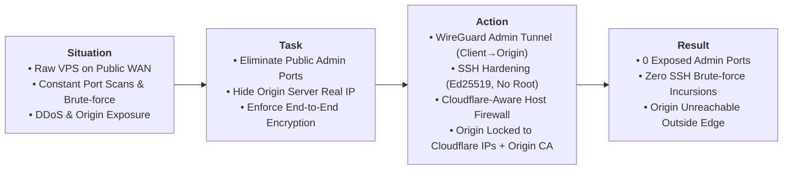

# Case 01: Perimeter Hardening, Edge Security & Zero-Trust Administration

> **Domain**: Infrastructure Security, Linux Administration, Network Hardening
>
> **Technologies**: Linux, Cloudflare Edge & WAF, WireGuard VPN, OpenSSH, UFW / iptables, Origin TLS 
>
> **Methodology**: S.T.A.R. Framework (Situation, Task, Action, Result)

## Executive Summary (S.T.A.R. Breakdown)



---

* **Situation**: Instantiating a cloud Linux self hosting VPS with a public IPv4 immediately exposes the machine to scanning engines and non-stop SSH brute-force campaigns.
* **Task**: Harden the host perimeter, eliminate exposed administrative attack surfaces from the public internet, ensure remote operations run exclusively through an encrypted private overlay and guarantee that **100% of public HTTP/S traffic is filtered by Cloudflare Edge (WAF/DDoS)** with zero possibility of direct-to-IP bypass attacks.
* **Action (Technical Implementation)**:
  1. **SSH Identity Hardening**: Disabled remote `root` login, disabled password authentication entirely, enforced asymmetric `Ed25519` key pairs and defined an explicit administrative user whitelist (`AllowUsers`).
  2. **Zero-Trust Administrative Overlay (WireGuard S2C)**: Deployed a **WireGuard** Site-to-Client VPN (UDP 51820). The OpenSSH daemon and telemetry endpoints were restricted to respond exclusively across the private VPN overlay subnet (`10.10.10.0/24`).
  3. **Cloudflare-Aware Host Firewall (Default-DROP)**: Configured host-level firewall rules (UFW / netfilter) enforcing an unconditional default-DROP policy on inbound WAN traffic. Ports 80 and 443 strictly authorize official Cloudflare CIDR blocks. Direct-to-IP connection attempts from unauthorized public sources are silently dropped at the packet filtering level.
  4. **Strict Cryptographic Ingress**: Installed Cloudflare Origin CA certificates on the origin reverse proxy and enabled **Full (Strict) SSL/TLS mode**, ensuring authenticated end-to-end encryption without risk of Man-in-the-Middle (MitM) interception.
  5. **Edge Threat Mitigation (WAF)**: Configured Cloudflare Web Application Firewall custom rules to challenge high threat-score requests, block known abusive ASNs, and rate-limit sensitive endpoints.
* **Result (Quantifiable Engineering Proof)**:
  * **Zero exposed administrative ports on WAN**: External port audits and scanners detect zero accessible management services.
  * **SSH brute-force attempts reduced to 0 on the host**: The SSH daemon receives zero packets from outside the WireGuard tunnel.
  * **Cloudflare bypass neutralization**: Direct TCP/HTTPS connections to the origin VPS IP address timeout immediately.

---

## Configuration Artifacts & Reference Code

### 1. Generate SSH Key Pair
To generate a modern, secure SSH key compatible with virtually any VPS provider, the recommended standard is **Ed25519**.

Open the terminal and type the following command:
```bash
ssh-keygen -t ed25519 -C "email@example.com" -f ~/.ssh/my_key
```
- `-t ed25519`: Defines the algorithm (faster and more secure than the old RSA).
- `-C`: Adds a comment (usually email) to identify the key on the server.
- `-f`: Defines a specific name and path for the key.

The terminal will ask two questions:
1. **Enter passphrase**: (Recommended) Enter a password to protect the private key file. Or press Enter twice to leave it without a password (passphrase empty).
2. **Enter same passphrase again**: Repeat the password.

The command will create two files in the `~/.ssh` folder:
- `my_key`: My Private Key. Never share this file.
- `my_key.pub`: My Public Key. This is the file I will send to the VPS provider.

I will need to copy the text inside the public key to paste into my provider's control panel. Use the command below to display the text:
```bash
cat ~/.ssh/my_key.pub
```

---

### 2. System Base Configuration
This section explains how to configure Linux OS base for secure and predictable administration before installing any stack.

**Initial update and base packages**

Install tools that assist in diagnosing and editing files on a daily basis.
```bash
sudo dnf check-update
sudo dnf -y update 
sudo dnf -y install ca-certificates curl wget gnupg2 vim nano jq unzip tar rsync bind-utils chrony
```
- `ca-certificates`, `curl`, `gnupg`: foundation for reliable repositories and downloads.
- `bind-utils`: necessary for debugging routes, domains and ports.
- `chrony`: correct timing avoids chaos with TLS, logs and validation.
- `vim`, `nano`: indispensable text editors for configuring system files.
- `jq`: JSON file processor via command line (essential for APIs and automations).
- `unzip`, `tar`: standard tools for unpacking packages and backups.
- `rsync`: efficient protocol for transferring and sync files between servers.
- `wget`: utility for downloading files via HTTP/HTTPS/FTP.

**Create an administrative user**

Before creating the administrative user, change the default root password and store it in a password manager, preferably.

Change `root` user password:
```bash
passwd root
```
This password will be used whenever I need to log in as `root`.

#### a. Create a user with sudo
The first step is to create a security layer by creating a regular user with administrative permissions.

Create a dedicated user (e.g., ops, admin, or any other name) and grant superuser privileges.

> [!NOTE]
> The commands below are executed as root.

Create `<username>` user
```bash
useradd -m <username>
```
Set password for this user:
```bash
passwd <username>
```
Add to group 'wheel'(group that allows using sudo in this distro):
```bash
usermod -aG wheel <username>
```
⚠️ Important test (without closing the current window):
> [!IMPORTANT]
> Never log out of the root terminal without first testing the new user.

#### b. Copy SSH key to the new user
From now on, I will use the <username> user for everything!

Therefore, I have to ensure I can access my server without root using an SSH public key.

On my computer (or wherever my SSH public key was generated or is stored), run the command below to copy the public key to my VPS server and make it available to the newly created <username> user:

> [!IMPORTANT]
> Note on key reuse
>
> Using the same SSH key for `root` and the administrative user works, but reduces the security isolation between the two accounts, because if the key is leaked, both accesses are compromised together.
>
> To ensure complete security, consider generating a dedicated key per user.

```bash
ssh-copy-id -i ~/.ssh/my_key.pub <username>@SERVER_IP
```
Test login as <username> user using SSH key:
```bash
ssh -i ~/.ssh/my_key <username>@SERVER_IP
````
---

### 3. Domain registration and DNS delegation in Cloudflare (DNS Only)
First I need to have a valid domain and I will delegate the DNS authority of this domain to Cloudflare, operating exclusively in DNS only.

&rarr; Why is the domain mandatory?
A correctly configured domain is a technical prerequisite for:
- **SSL/TLS Certificates**: The future issuance of SSL/TLS certificates requires that the domain is already assigned to the IP of the VPS to validate the ownership of the server.
- **Standard administrative access**: Using `ssh <username>@srv1.domain.com` is superior to using IP. If I need to change my server, just update the DNS and automation, monitoring and access scripts will continue working without alterations.
- **Reputation and security**: The domain allows me to implement layers of protection that direct IPs do not support, protecting my Web App against global attacks from bots.

#### Domain Delegation to Cloudflare
Cloudflare will act as my primary DNS zone, providing near-instant propagation and a foundation for future security. It will also serve as a central point for name management.

a. **DNS Operating Modes in Cloudflare**

In Cloudflare, each DNS record can operate in two modes:
- DNS Only (gray cloud)
	- Cloudflare only responds to DNS queries.
	- Traffic goes directly to your VPS IP.
- Proxied (orange cloud)
	- Cloudflare intercepts HTTP/HTTPS traffic,
	- Applies proxy, TLS, WAF, caching, etc.

b. **Adding the domain to Cloudflare**

With the domain registered, the next step is to use Cloudflare to manage the DNS. This involves adding the domain to a Cloudflare account and changing the nameservers at the registrar to point to Cloudflare.

After accessing Cloudflare dashboard, I follow the steps below:

1. Click on **Add Domain** in the Cloudflare dashboard. When prompted, enter the domain (just the base name, for example, mysite.com, without www).
2. Select a Cloudflare plan. For my purpose, I choose the Free plan. It's sufficient for everything that I build.
3. Cloudflare will then scan the domain's current DNS records and list what it finds. **Review the detected DNS records** and adjust if necessary. If the domain is new, there may only be default records or no records at all. The important thing is to proceed with the Cloudflare setup until I reach the nameservers screen.
4. In the final step of adding the domain, Cloudflare will display two custom nameservers assigned to my domain (for example: `dana.ns.cloudflare.com` and `nick.ns.cloudflare.com`).
5. Copy the two displayed nameservers and proceed to change the domain's nameservers in my registrar's control panel (where I purchased the domain) to the values ​​provided by Cloudflare. The process varies depending on the registrar where the domain was purchased, but the logic is the same across all:
	a. Access the registrar's control panel,
	b. Locate the domain's nameserver settings, and
	c. Replace the existing values ​​with the two provided by Cloudflare.
6. With the nameservers changed at the registrar, return to Cloudflare and click Done, check nameservers to start the verification.

**DNS Propagation Time**

After changing the nameservers at my registrar (where I purchased the domain), I need to wait for DNS propagation. That is, the nameserver information is updated on all DNS servers on the Internet.

During propagation, my domain may not resolve correctly. Monitor the propagation directly from the terminal. To check if the nameservers are already pointing to Cloudflare:
```bash
dig NS mysite.com +short
```
The expected result is the two Cloudflare nameservers (e.g., `dana.ns.cloudflare.com`, `nick.ns.cloudflare.com`). As long as the old registrar nameservers are still shown, propagation is not yet complete.

c. **DNS Configuration in Cloudflare**

With the domain active in Cloudflare (nameservers propagated), all DNS management is now done in the Cloudflare control panel. Add the necessary DNS records to point the traffic to my server:
1. In the **Cloudflare Dashboard**, select the domain and go to the **DNS > Records** tab. I will see a table to manage the domain's DNS records.
2. **Create an A record** pointing the root domain to my VPS's IP address. To do this: click **Add Record**. Select **Type = A**. In **Name**, enter `@` (representing the root domain itself, `mysite.com`). In **IPv4 address**, enter the public IP address of my VPS server (e.g., `123.45.67.89`). The Proxy (Orange Cloud) should remain disabled. This ensures I am connecting directly to the VPS's IP address, facilitating SSL certificate issuance and latency testing. Change to DNS Only (Gray Cloud ☁️).
3. **Create another A record** pointing the subdomain `srv01` to the VPS's IP address. Click Add Record again. Select **Type = A**. In Name, enter `srv01`. In the **IPv4 address field**, enter the public IP address of the server. Change to **DNS Only** (Gray Cloud ☁️). Save. This ensures that `srv01.mysite.com` also points to my VPS and Cloudflare will respond on its behalf.
4. **Create another A record** pointing the VPN subdomain to my VPS IP address. Click Add Record again. Select **Type = A**. In Name, enter `vpn`. In the IPv4 address field, enter the public IP address of the VPS server. Change to **DNS Only** (Gray Cloud ☁️). Save. This ensures that `vpn.mysite.com` also points to my VPS and Cloudflare will respond on its behalf.

After adding the records, my DNS in Cloudflare should have at least:
- one **A record** for `mysite.com` pointing to the VPS IP and
- another **A record** for `srv01` pointing to the VPS IP.
- another **A record** for `vpn` pointing to the VPS IP.

| Type | Name  | Value        | Proxy     | Destination            | Purpose              |
|------|-------|--------------|-----------|------------------------|----------------------|
| A    | @     | VPS IP       | DNS Only  | mysite.com             | Root domain          |
| A    | srv01 | VPS IP       | DNS Only  | srv01.mysite.com       | Administration       |
| A    | vpn   | VPS IP       | DNS Only  | vpn.mysite.com         | VPN connection       |

---

### 4. Admin Access Hardening (`/etc/ssh/sshd_config.d`)
This configuration neutralizes the two primary attack surfaces in administrative access: a permissive SSH daemon and direct remote root execution.

SSH is the server's administrative gateway. If this gateway is poorly protected, the rest of the infrastructure is irrelevant. Firewalls, VPNs and reverse proxies don't compensate for exposed administrative access.

Automated attacks exploit exactly three recurring vulnerabilities:
- remote login as root;
- authentication via password exposed to the internet;
- permissive or implicit configuration of sshd.

```sshd_config
# It only forces cryptographic keys; it prohibits passwords and interactivity
AuthenticationMethods publickey
PubkeyAuthentication yes
PasswordAuthentication no
KbdInteractiveAuthentication no
ChallengeResponseAuthentication no
PermitEmptyPasswords no

# Prohibit remote login as root, whether using a password or a key
PermitRootLogin no

# Restricts access exclusively to administrative users
AllowUsers <username>

# Ends idle sessions (5 minutes of inactivity)
ClientAliveInterval 300
ClientAliveCountMax 0

# Disables unnecessary tunnels and redirects
X11Forwarding no
AllowTcpForwarding no
AllowAgentForwarding no

# Structured Audit Logging
LogLevel VERBOSE
```

The `AuthenticationMethods publickey` blocks any authentication attempts by other means. `PasswordAuthentication no` blocks brute-force password attacks. `PermitRootLogin no` prevents remote login as root even with a valid key (for administrative tasks I use `<username>` with `sudo`).

`AllowUsers <username>` restricts the daemon to accept connections only from the `<username>` user. `AllowTcpForwarding no` disables port forwarding via SSH, unnecessary because the VPN tunnel will cover this role.

For other settings:
- `PubkeyAuthentication yes`: Explicitly enforces allowing only key authentication.
- `PermitEmptyPasswords no`: This ensures that accounts with empty passwords cannot authenticate, adding another layer of security.
- `ChallengeResponseAuthentication no`: Disables the challenge-response authentication method, which can be susceptible to interception.
- `AuthenticationMethods publickey`: Defines that the only allowed authentication method is via public key, ensuring that only users with the corresponding key can access the server.
- `AllowUsers <username>`: This allows the user `<username>` to access the server. I can add other users to the list, separated by spaces.

> [!IMPORTANT]
> Never restart SSH without validating first and keep one SSH session open while testing another.

**`sudo` Restriction**

With root blocked via SSH and <username> user as the only access to the server, unrestricted sudo is the next step. <username> user has been in the `wheel` group (AlmaLinux) since its creation.

This means that any command can be executed as root, or anything an attacker wants to run if they compromise the account.

The principle adopted will be that <username> user only has standard access and I will subsequently grant exactly the permissions required. Nothing more.

Before removing it from the group, I create a dedicated `sudoers` file for <username> user. If I remove it first, I lose the ability to execute any privileged commands.

Log in directly as root.

> [!WARNING]
> From now on, I will be operating as root until I run `exit`. Use it only for specific administrative tasks that granular sudoers does not cover.
```bash
su -
```
Create and populate the `sudoers` file:
```bash
visudo -f /etc/sudoers.d/ops
```
```bash
# Service management
<username> ALL=(root) NOPASSWD: /usr/bin/systemctl

# Log reading
<username> ALL=(root) NOPASSWD: /usr/bin/journalctl

# Package installation and updates
# AlmaLinux
<username> ALL=(root) NOPASSWD: /usr/bin/dnf
```
With these restrictions, the <username> user can manage services and install or update system packages.

However, <username> user will not be able to modify system configurations that do not go through these binaries or execute any other arbitrary privileged command. Additional entries will be included as needed.

Now, proceed to save and validate the syntax of the `/etc/sudoers.d/<username>` file:
```bash
visudo -cf /etc/sudoers.d/<username>
```
Expected output:
```bash
/etc/sudoers.d/ops: parsed OK
```
Confirm the actual account privilege inventory:
```bash
sudo -l -U ops
```
Expected output:
```text
User <username> may run the following commands:
(root) NOPASSWD: /usr/bin/systemctl
(root) NOPASSWD: /usr/bin/journalctl
(root) NOPASSWD: /usr/bin/dnf
```
If anything appears beyond the entries I defined, investigate before continuing. Now remove <username> user from the unrestricted sudo group:
```bash
# AlmaLinux
gpasswd -d ops wheel
```
Finally, end the `root` user session:
```bash
exit
```
Now, start a new SSH connection without any active root session:
```bash
ssh -i ~/.ssh/my_key <username>@srv01.mysite.com
```
Invalidate any residual authentication cache and confirm the lock:
```bash
sudo -k
sudo whoami
```

**Adding entries to sudoers in the future**

Whenever I have a requisition to a new privilege for <username> user, the flow is the same: log in as root via `su -`, edit the file, validate and exit.
```bash
su -
visudo -f /etc/sudoers.d/ops
visudo -cf /etc/sudoers.d/ops
exit
```

**Expected end state**

At this point:
- only the <username> user accesses the server exclusively via SSH key;
- no passwords travel over the network;
- `root` is inaccessible remotely;
- The scope of sudo is restricted to the minimum necessary for this phase, with controlled expansion as required;
- SSH authentication logs are auditable.

This eliminates the largest initial attack surface of Linux servers.

---

### 5. VPN Site-to-Client (S2C) and Private Administration
This section isolates server management from the internet, creating an encrypted tunnel that makes the infrastructure invisible to external scans and limits access only to authorized devices.

Even with key-protected SSH and root blocked, exposing the administrative port to the public internet is an unnecessary risk.

Bots don't "try passwords," they map, enumerate and correlate patterns. The VPN adds a network layer on top of the identity layer I've already protected, as the server stops responding to any internet IP except for traffic traveling inside the tunnel.

The goal here is to close all ports in the firewall and create a "private bridge" between my device and the server.

**VPN Site-to-Client (S2C)**

Unlike a commercial VPN (which serves to hide my browsing), an S2C VPN connects the administrator to the server's internal network. 

The **Server (Site)** acts as the private endpoint. The **Administrator (Client)** connects to the server via an encrypted tunnel. Thus, the server stops responding to any IP address on the internet, except for traffic traveling through the VPN tunnel.

With the adoption of a S2C VPN, even if SSH has a low vulnerability, the attacker will not even be able to "see" that the port exists if they are not inside the VPN.

My device gains a fixed internal IP address (e.g., 10.8.0.2), allowing for extremely restrictive firewall rules. Furthermore, it allows me to manage my server with complete security, even when connected to public Wi-Fi or third-party networks. I transform the server from "difficult to attack" to "invisible to those who shouldn't see it."

#### Wireguard Adopted Architecture

```mermaid
flowchart LR
    subgraph ADMIN["ADMINISTRATOR (VPN CLIENT)"]
        direction TB
        A1["ADMINISTRATOR (CLIENT)<br/><i>STATELESS</i>"]
        A2["Device gets fixed internal IP<br/>(e.g. 10.8.0.2)"]
        A3["Step 1: Activate VPN tunnel<br/>Step 2: Access via internal IP / hostname"]
        A4["PRIVATE ADMINISTRATOR<br/><i>PRIVATE ADMINISTRATION</i><br/><i>STATELESS</i>"]
        A1 --> A2 --> A3
    end
 
    NOTE1["Minimalist code<br/>Less surface for vulnerabilities"]
 
    INTERNET(("PUBLIC INTERNET"))
 
    TUNNEL["🔒 ENCRYPTED TUNNEL (UDP 51820) 🔒<br/><b>WIREGUARD</b>"]
    PERF["High performance<br/>UDP stealth behavior"]
 
    subgraph VPS["VPS SERVER (SITE VPN)"]
        direction TB
        V1["ENDPOINT<br/>WIREGUARD / GATEWAY"]
        V2["PRIVATE INTERFACE<br/>VPN wg0"]
        V3["INTERNAL RESOURCES"]
        V4["Access via private IP / internal hostname (wg0)<br/><i>PERSISTENT</i>"]
        V5["✔ Firewall rules based on internal IP<br/>✔ Conceptualize the internal client fixed IP determination"]
        V1 --> V2 --> V3
    end
 
    subgraph ATK_TOP["EXTERNAL ATTACKERS (top)"]
        AT1["☠ EXTERNAL ATTACKERS"]
    end
 
    BLOCK1["🚫 NON-TUNNEL ACCESS BLOCKED"]
    BLOCK2["🚫 NON-TUNNEL ACCESS BLOCKED"]
    SSH["❌ SSH P22"]
    PORT["❌ Port 51820/UDP blocked for external scanner"]
 
    subgraph ATK_BOTTOM["EXTERNAL ATTACKERS (bottom)"]
        AT2["☠ EXTERNAL ATTACKERS"]
    end
 
    BLOCK3["🚫 NON-TUNNEL, NON-TUNNEL ACCESS BLOCKED"]
    STEP3["⚠ Step 3: The firewall blocks everything outside the tunnel"]
    UNAUTH["❌ Unauthorized internet IPs"]
 
    QUOTE["\"WireGuard VPN S2C: Modern encryption<br/>and external invisibility via UDP stealth.\""]
 
    ADMIN <--> INTERNET
    INTERNET <--> TUNNEL
    TUNNEL <--> V1
 
    AT1 -.blocked.-> BLOCK1
    BLOCK1 -.-> AT1
    V1 -.-> BLOCK2
    BLOCK2 -.-> AT1
    V1 -- attempt --> SSH
    SSH -.-> AT1
    V1 -- attempt --> PORT
    PORT -.-> AT1
 
    AT2 -- attempt --> BLOCK3
    ADMIN -.-> BLOCK3
    UNAUTH -- attempt --> BLOCK3
    BLOCK3 -.-> STEP3
 
    V3 --> V5
 ```
