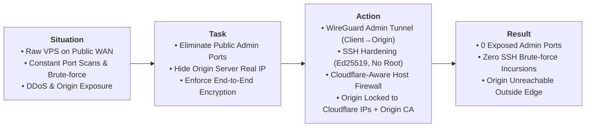

# Case 01: Perimeter Hardening, Edge Security & Zero-Trust Administration

> **Domain**: Infrastructure Security, Linux Administration, Network Hardening
>
> **Technologies**: Linux, Cloudflare Edge & WAF, WireGuard VPN, OpenSSH, UFW / iptables, Origin TLS 
>
> **Methodology**: S.T.A.R. Framework (Situation, Task, Action, Result)

## Executive Summary (S.T.A.R. Breakdown)

---

* **Situation**: Instantiating a cloud Linux self hosting VPS with a public IPv4 immediately exposes the machine to scanning engines and non-stop SSH brute-force campaigns.
* **Task**: Harden the host perimeter, eliminate exposed administrative attack surfaces from the public internet, ensure remote operations run exclusively through an encrypted private overlay and guarantee that **100% of public HTTP/S traffic is filtered by Cloudflare Edge (WAF/DDoS)** with zero possibility of direct-to-IP bypass attacks.
* **Action (Technical Implementation)**:
  1. **SSH Identity Hardening**: Disabled remote `root` login, disabled password authentication entirely, enforced asymmetric `Ed25519` key pairs and defined an explicit administrative user whitelist (`AllowUsers`).
  2. **Zero-Trust Administrative Overlay (WireGuard S2C)**: Deployed a **WireGuard** Site-to-Client VPN (UDP 51820). The OpenSSH daemon and telemetry endpoints were restricted to respond exclusively across the private VPN overlay subnet (`10.10.10.0/24`).
  3. **Cloudflare-Aware Host Firewall (Default-DROP)**: Configured host-level firewall rules (UFW / netfilter) enforcing an unconditional default-DROP policy on inbound WAN traffic. Ports 80 and 443 strictly authorize official Cloudflare CIDR blocks. Direct-to-IP connection attempts from unauthorized public sources are silently dropped at the packet filtering level.
  4. **Strict Cryptographic Ingress**: Installed Cloudflare Origin CA certificates on the origin reverse proxy and enabled **Full (Strict) SSL/TLS mode**, ensuring authenticated end-to-end encryption without risk of Man-in-the-Middle (MitM) interception.
  5. **Edge Threat Mitigation (WAF)**: Configured Cloudflare Web Application Firewall custom rules to challenge high threat-score requests, block known abusive ASNs, and rate-limit sensitive endpoints.
* **Result (Quantifiable Engineering Proof)**:
  * **Zero exposed administrative ports on WAN**: External port audits and scanners detect zero accessible management services.
  * **SSH brute-force attempts reduced to 0 on the host**: The SSH daemon receives zero packets from outside the WireGuard tunnel.
  * **Cloudflare bypass neutralization**: Direct TCP/HTTPS connections to the origin VPS IP address timeout immediately.

---
