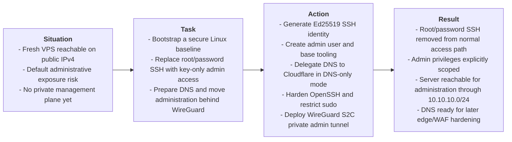

# Case 01: VPS Perimeter Foundation & Zero-Trust Administration

> **Domain**: Infrastructure Security, Linux Administration, Network Hardening
>
> **Technologies**: AlmaLinux, Cloudflare DNS, WireGuard VPN, OpenSSH, firewalld, sudoers
>
> **Methodology**: S.T.A.R. Framework (Situation, Task, Action, Result)

---

## Table of Contents

- [Executive Summary (S.T.A.R. Breakdown)](#executive-summary-star-breakdown)
- [Configuration Artifacts & Reference Code](#configuration-artifacts--reference-code)
  - [1. Generate SSH Key Pair](#1-generate-ssh-key-pair)
  - [2. System Base Configuration](#2-system-base-configuration)
    - [a. Create a user with sudo](#a-create-a-user-with-sudo)
    - [b. Copy SSH key to the new user](#b-copy-ssh-key-to-the-new-user)
  - [3. Domain registration and DNS delegation in Cloudflare (DNS Only)](#3-domain-registration-and-dns-delegation-in-cloudflare-dns-only)
    - [Domain Delegation to Cloudflare](#domain-delegation-to-cloudflare)
  - [4. Admin Access Hardening (`/etc/ssh/sshd_config.d`)](#4-admin-access-hardening-etcsshsshd_configd)
  - [5. VPN Site-to-Client (S2C) and Private Administration](#5-vpn-site-to-client-s2c-and-private-administration)
    - [WireGuard Adopted Architecture](#wireguard-adopted-architecture)
    - [1. Connect via SSH](#1-connect-via-ssh)
    - [2. WireGuard Installation](#2-wireguard-installation)
    - [3. Server Side](#3-server-side)
      - [3.1 Keys Generation](#31-keys-generation)
      - [3.2 VPN Interface Configuration `wg0`](#32-vpn-interface-configuration-wg0)
      - [3.3 Firewall Configuration (Server)](#33-firewall-configuration-server)
    - [4. Client Side](#4-client-side)
      - [4.1 Keys Generation](#41-keys-generation)
      - [4.2 Client Registration on Server](#42-client-registration-on-server)
    - [5. Start the VPN](#5-start-the-vpn)
    - [6. Admin Device Configuration (Client)](#6-admin-device-configuration-client)
    - [7. Exclusively Private Administration](#7-exclusively-private-administration)

---

## Executive Summary (S.T.A.R. Breakdown)



---

* **Situation**: Instantiating a cloud Linux self-hosted VPS with a public IPv4 immediately creates an exposed administrative surface. Before any application stack, reverse proxy or public web ingress exists, the server needs a controlled identity model, predictable DNS and a private administration path.
* **Task**: Build the first security baseline for the VPS: generate a dedicated SSH identity, create a non-root administrative account, configure Cloudflare DNS records, harden OpenSSH, reduce standing sudo privileges and establish a WireGuard Site-to-Client tunnel so future administration can move away from the public interface.
* **Action (Technical Implementation)**:
  1. **SSH Identity Bootstrap**: Generated an `Ed25519` key pair and copied the public key to the future administrative account.
  2. **System Base Configuration**: Updated the host, installed operational tooling, configured time synchronization and created a named administrative user with initial `wheel` access for setup.
  3. **Cloudflare DNS Foundation**: Delegated the domain to Cloudflare and created DNS-only `A` records for the root domain, `srv01` and `vpn`, keeping records unproxied while the host baseline and VPN endpoint are being established.
  4. **Administrative Access Hardening**: Disabled remote `root` login, disabled password and interactive SSH authentication, enforced public-key authentication, limited SSH login through `AllowUsers` and replaced broad `wheel` access with explicit sudoers entries.
  5. **WireGuard Private Administration**: Deployed a WireGuard Site-to-Client VPN on `10.10.10.0/24`, assigned the server `10.10.10.1`, assigned the admin device `10.10.10.2/32` and shifted the `srv01` administrative DNS record to the private VPN address.
* **Result (Current Engineering Proof)**:
  * **Key-only administrative access established**: The operational user can authenticate with the generated SSH key while root and password-based SSH access are removed from the normal remote access path.
  * **Sudo blast radius reduced**: Administrative privilege is expressed through auditable `/etc/sudoers.d/<username>` entries instead of permanent unrestricted `wheel` access.
  * **Private management plane created**: The server and admin device communicate over WireGuard using fixed internal addresses in `10.10.10.0/24`.
  * **DNS aligned to the access model**: `vpn.mysite.com` remains a public DNS-only endpoint for tunnel establishment, while `srv01.mysite.com` resolves to `10.10.10.1` for VPN-only administration.
  * **Ready for the next perimeter step**: With private administration validated, public SSH exposure can be closed at the firewall without losing operator access.

---

## Configuration Artifacts & Reference Code

### 1. Generate SSH Key Pair
To generate a modern, secure SSH key compatible with virtually any VPS provider, the recommended standard is **Ed25519**.

Open the terminal and type the following command:
```bash
ssh-keygen -t ed25519 -C "email@example.com" -f ~/.ssh/my_key
```
- `-t ed25519`: Defines the algorithm (faster and more secure than the old RSA).
- `-C`: Adds a comment (usually email) to identify the key on the server.
- `-f`: Defines a specific name and path for the key.

The terminal will ask two questions:
1. **Enter passphrase**: (Recommended) Enter a password to protect the private key file. Or press Enter twice to leave it without a password (passphrase empty).
2. **Enter same passphrase again**: Repeat the password.

The command will create two files in the `~/.ssh` folder:
- `my_key`: My Private Key. Never share this file.
- `my_key.pub`: My Public Key. This is the file I will send to the VPS provider.

I will need to copy the text inside the public key to paste into my provider's control panel. Use the command below to display the text:
```bash
cat ~/.ssh/my_key.pub
```

---

### 2. System Base Configuration
This section explains how to configure Linux OS base for secure and predictable administration before installing any stack.

**Initial update and base packages**

Install tools that assist in diagnosing and editing files on a daily basis.
```bash
sudo dnf check-update
sudo dnf -y update 
sudo dnf -y install ca-certificates curl wget gnupg2 vim nano jq unzip tar rsync bind-utils chrony
```
- `ca-certificates`, `curl`, `gnupg`: foundation for reliable repositories and downloads.
- `bind-utils`: necessary for debugging routes, domains and ports.
- `chrony`: correct timing avoids chaos with TLS, logs and validation.
- `vim`, `nano`: indispensable text editors for configuring system files.
- `jq`: JSON file processor via command line (essential for APIs and automations).
- `unzip`, `tar`: standard tools for unpacking packages and backups.
- `rsync`: efficient protocol for transferring and sync files between servers.
- `wget`: utility for downloading files via HTTP/HTTPS/FTP.

**Create an administrative user**

Before creating the administrative user, change the default root password and store it in a password manager, preferably.

Change `root` user password:
```bash
passwd root
```
This password will be used whenever I need to log in as `root`.

#### a. Create a user with sudo
The first step is to create a security layer by creating a regular user with administrative permissions.

Create a dedicated user (e.g., ops, admin, or any other name) and grant superuser privileges.

> [!NOTE]
> The commands below are executed as root.

Create `<username>` user
```bash
useradd -m <username>
```
Set password for this user:
```bash
passwd <username>
```
Add to group 'wheel'(group that allows using sudo in this distro):
```bash
usermod -aG wheel <username>
```
⚠️ Important test (without closing the current window):
> [!IMPORTANT]
> Never log out of the root terminal without first testing the new user.

#### b. Copy SSH key to the new user
From now on, I will use the <username> user for everything!

Therefore, I have to ensure I can access my server without root using an SSH public key.

On my computer (or wherever my SSH public key was generated or is stored), run the command below to copy the public key to my VPS server and make it available to the newly created <username> user:

> [!IMPORTANT]
> Note on key reuse
>
> Using the same SSH key for `root` and the administrative user works, but reduces the security isolation between the two accounts, because if the key is leaked, both accesses are compromised together.
>
> To ensure complete security, consider generating a dedicated key per user.

```bash
ssh-copy-id -i ~/.ssh/my_key.pub <username>@SERVER_IP
```
Test login as <username> user using SSH key:
```bash
ssh -i ~/.ssh/my_key <username>@SERVER_IP
````
---

### 3. Domain registration and DNS delegation in Cloudflare (DNS Only)
First I need to have a valid domain and I will delegate the DNS authority of this domain to Cloudflare, operating exclusively in DNS only.

&rarr; Why is the domain mandatory?
A correctly configured domain is a technical prerequisite for:
- **SSL/TLS Certificates**: The future issuance of SSL/TLS certificates requires that the domain is already assigned to the IP of the VPS to validate the ownership of the server.
- **Standard administrative access**: Using `ssh <username>@srv1.domain.com` is superior to using IP. If I need to change my server, just update the DNS and automation, monitoring and access scripts will continue working without alterations.
- **Reputation and security**: The domain allows me to implement layers of protection that direct IPs do not support, protecting my Web App against global attacks from bots.

#### Domain Delegation to Cloudflare
Cloudflare will act as my primary DNS zone, providing near-instant propagation and a foundation for future security. It will also serve as a central point for name management.

a. **DNS Operating Modes in Cloudflare**

In Cloudflare, each DNS record can operate in two modes:
- DNS Only (gray cloud)
	- Cloudflare only responds to DNS queries.
	- Traffic goes directly to your VPS IP.
- Proxied (orange cloud)
	- Cloudflare intercepts HTTP/HTTPS traffic,
	- Applies proxy, TLS, WAF, caching, etc.

b. **Adding the domain to Cloudflare**

With the domain registered, the next step is to use Cloudflare to manage the DNS. This involves adding the domain to a Cloudflare account and changing the nameservers at the registrar to point to Cloudflare.

After accessing Cloudflare dashboard, I follow the steps below:

1. Click on **Add Domain** in the Cloudflare dashboard. When prompted, enter the domain (just the base name, for example, mysite.com, without www).
2. Select a Cloudflare plan. For my purpose, I choose the Free plan. It's sufficient for everything that I build.
3. Cloudflare will then scan the domain's current DNS records and list what it finds. **Review the detected DNS records** and adjust if necessary. If the domain is new, there may only be default records or no records at all. The important thing is to proceed with the Cloudflare setup until I reach the nameservers screen.
4. In the final step of adding the domain, Cloudflare will display two custom nameservers assigned to my domain (for example: `dana.ns.cloudflare.com` and `nick.ns.cloudflare.com`).
5. Copy the two displayed nameservers and proceed to change the domain's nameservers in my registrar's control panel (where I purchased the domain) to the values ​​provided by Cloudflare. The process varies depending on the registrar where the domain was purchased, but the logic is the same across all:
	a. Access the registrar's control panel,
	b. Locate the domain's nameserver settings, and
	c. Replace the existing values ​​with the two provided by Cloudflare.
6. With the nameservers changed at the registrar, return to Cloudflare and click Done, check nameservers to start the verification.

**DNS Propagation Time**

After changing the nameservers at my registrar (where I purchased the domain), I need to wait for DNS propagation. That is, the nameserver information is updated on all DNS servers on the Internet.

During propagation, my domain may not resolve correctly. Monitor the propagation directly from the terminal. To check if the nameservers are already pointing to Cloudflare:
```bash
dig NS mysite.com +short
```
The expected result is the two Cloudflare nameservers (e.g., `dana.ns.cloudflare.com`, `nick.ns.cloudflare.com`). As long as the old registrar nameservers are still shown, propagation is not yet complete.

c. **DNS Configuration in Cloudflare**

With the domain active in Cloudflare (nameservers propagated), all DNS management is now done in the Cloudflare control panel. Add the necessary DNS records to point the traffic to my server:
1. In the **Cloudflare Dashboard**, select the domain and go to the **DNS > Records** tab. I will see a table to manage the domain's DNS records.
2. **Create an A record** pointing the root domain to my VPS's IP address. To do this: click **Add Record**. Select **Type = A**. In **Name**, enter `@` (representing the root domain itself, `mysite.com`). In **IPv4 address**, enter the public IP address of my VPS server (e.g., `123.45.67.89`). The Proxy (Orange Cloud) should remain disabled. This ensures I am connecting directly to the VPS's IP address, facilitating SSL certificate issuance and latency testing. Change to DNS Only (Gray Cloud ☁️).
3. **Create another A record** pointing the subdomain `srv01` to the VPS's IP address. Click Add Record again. Select **Type = A**. In Name, enter `srv01`. In the **IPv4 address field**, enter the public IP address of the server. Change to **DNS Only** (Gray Cloud ☁️). Save. This ensures that `srv01.mysite.com` also points to my VPS and Cloudflare will respond on its behalf.
4. **Create another A record** pointing the VPN subdomain to my VPS IP address. Click Add Record again. Select **Type = A**. In Name, enter `vpn`. In the IPv4 address field, enter the public IP address of the VPS server. Change to **DNS Only** (Gray Cloud ☁️). Save. This ensures that `vpn.mysite.com` also points to my VPS and Cloudflare will respond on its behalf.

After adding the records, my DNS in Cloudflare should have at least:
- one **A record** for `mysite.com` pointing to the VPS IP and
- another **A record** for `srv01` pointing to the VPS IP.
- another **A record** for `vpn` pointing to the VPS IP.

| Type | Name  | Value        | Proxy     | Destination            | Purpose              |
|------|-------|--------------|-----------|------------------------|----------------------|
| A    | @     | VPS IP       | DNS Only  | mysite.com             | Root domain          |
| A    | srv01 | VPS IP       | DNS Only  | srv01.mysite.com       | Administration       |
| A    | vpn   | VPS IP       | DNS Only  | vpn.mysite.com         | VPN connection       |

---

### 4. Admin Access Hardening (`/etc/ssh/sshd_config.d`)
This configuration neutralizes the two primary attack surfaces in administrative access: a permissive SSH daemon and direct remote root execution.

SSH is the server's administrative gateway. If this gateway is poorly protected, the rest of the infrastructure is irrelevant. Firewalls, VPNs and reverse proxies don't compensate for exposed administrative access.

Automated attacks exploit exactly three recurring vulnerabilities:
- remote login as root;
- authentication via password exposed to the internet;
- permissive or implicit configuration of sshd.

```sshd_config
# It only forces cryptographic keys; it prohibits passwords and interactivity
AuthenticationMethods publickey
PubkeyAuthentication yes
PasswordAuthentication no
KbdInteractiveAuthentication no
ChallengeResponseAuthentication no
PermitEmptyPasswords no

# Prohibit remote login as root, whether using a password or a key
PermitRootLogin no

# Restricts access exclusively to administrative users
AllowUsers <username>

# Ends idle sessions (5 minutes of inactivity)
ClientAliveInterval 300
ClientAliveCountMax 0

# Disables unnecessary tunnels and redirects
X11Forwarding no
AllowTcpForwarding no
AllowAgentForwarding no

# Structured Audit Logging
LogLevel VERBOSE
```

The `AuthenticationMethods publickey` blocks any authentication attempts by other means. `PasswordAuthentication no` blocks brute-force password attacks. `PermitRootLogin no` prevents remote login as root even with a valid key (for administrative tasks I use `<username>` with `sudo`).

`AllowUsers <username>` restricts the daemon to accept connections only from the `<username>` user. `AllowTcpForwarding no` disables port forwarding via SSH, unnecessary because the VPN tunnel will cover this role.

For other settings:
- `PubkeyAuthentication yes`: Explicitly enforces allowing only key authentication.
- `PermitEmptyPasswords no`: This ensures that accounts with empty passwords cannot authenticate, adding another layer of security.
- `ChallengeResponseAuthentication no`: Disables the challenge-response authentication method, which can be susceptible to interception.
- `AuthenticationMethods publickey`: Defines that the only allowed authentication method is via public key, ensuring that only users with the corresponding key can access the server.
- `AllowUsers <username>`: This allows the user `<username>` to access the server. I can add other users to the list, separated by spaces.

> [!IMPORTANT]
> Never restart SSH without validating first and keep one SSH session open while testing another.

**`sudo` Restriction**

With root blocked via SSH and <username> user as the only access to the server, unrestricted sudo is the next step. <username> user has been in the `wheel` group (AlmaLinux) since its creation.

This means that any command can be executed as root, or anything an attacker wants to run if they compromise the account.

The principle adopted will be that <username> user only has standard access and I will subsequently grant exactly the permissions required. Nothing more.

Before removing it from the group, I create a dedicated `sudoers` file for <username> user. If I remove it first, I lose the ability to execute any privileged commands.

Log in directly as root.

> [!WARNING]
> From now on, I will be operating as root until I run `exit`. Use it only for specific administrative tasks that granular sudoers does not cover.
```bash
su -
```
Create and populate the `sudoers` file:
```bash
visudo -f /etc/sudoers.d/ops
```
```bash
# Service management
<username> ALL=(root) NOPASSWD: /usr/bin/systemctl

# Log reading
<username> ALL=(root) NOPASSWD: /usr/bin/journalctl

# Package installation and updates
# AlmaLinux
<username> ALL=(root) NOPASSWD: /usr/bin/dnf
```
With these restrictions, the <username> user can manage services and install or update system packages.

However, <username> user will not be able to modify system configurations that do not go through these binaries or execute any other arbitrary privileged command. Additional entries will be included as needed.

Now, proceed to save and validate the syntax of the `/etc/sudoers.d/<username>` file:
```bash
visudo -cf /etc/sudoers.d/<username>
```
Expected output:
```bash
/etc/sudoers.d/ops: parsed OK
```
Confirm the actual account privilege inventory:
```bash
sudo -l -U ops
```
Expected output:
```text
User <username> may run the following commands:
(root) NOPASSWD: /usr/bin/systemctl
(root) NOPASSWD: /usr/bin/journalctl
(root) NOPASSWD: /usr/bin/dnf
```
If anything appears beyond the entries I defined, investigate before continuing. Now remove <username> user from the unrestricted sudo group:
```bash
# AlmaLinux
gpasswd -d ops wheel
```
Finally, end the `root` user session:
```bash
exit
```
Now, start a new SSH connection without any active root session:
```bash
ssh -i ~/.ssh/my_key <username>@srv01.mysite.com
```
Invalidate any residual authentication cache and confirm the lock:
```bash
sudo -k
sudo whoami
```

**Adding entries to sudoers in the future**

Whenever I have a requisition to a new privilege for <username> user, the flow is the same: log in as root via `su -`, edit the file, validate and exit.
```bash
su -
visudo -f /etc/sudoers.d/ops
visudo -cf /etc/sudoers.d/ops
exit
```

**Expected end state**

At this point:
- only the <username> user accesses the server exclusively via SSH key;
- no passwords travel over the network;
- `root` is inaccessible remotely;
- The scope of sudo is restricted to the minimum necessary for this phase, with controlled expansion as required;
- SSH authentication logs are auditable.

This eliminates the largest initial attack surface of Linux servers.

---

### 5. VPN Site-to-Client (S2C) and Private Administration
This section isolates server management from the internet, creating an encrypted tunnel that makes the infrastructure invisible to external scans and limits access only to authorized devices.

Even with key-protected SSH and root blocked, exposing the administrative port to the public internet is an unnecessary risk.

Bots don't "try passwords," they map, enumerate and correlate patterns. The VPN adds a network layer on top of the identity layer I've already protected, as the server stops responding to any internet IP except for traffic traveling inside the tunnel.

The goal here is to close all ports in the firewall and create a "private bridge" between my device and the server.

**VPN Site-to-Client (S2C)**

Unlike a commercial VPN (which serves to hide my browsing), an S2C VPN connects the administrator to the server's internal network. 

The **Server (Site)** acts as the private endpoint. The **Administrator (Client)** connects to the server via an encrypted tunnel. Thus, the server stops responding to any IP address on the internet, except for traffic traveling through the VPN tunnel.

With the adoption of a S2C VPN, even if SSH has a low vulnerability, the attacker will not even be able to "see" that the port exists if they are not inside the VPN.

My device gains a fixed internal IP address (e.g., 10.8.0.2), allowing for extremely restrictive firewall rules. Furthermore, it allows me to manage my server with complete security, even when connected to public Wi-Fi or third-party networks. I transform the server from "difficult to attack" to "invisible to those who shouldn't see it."

#### WireGuard Adopted Architecture

```mermaid
flowchart LR
    subgraph ADMIN["ADMINISTRATOR (VPN CLIENT)"]
        direction TB
        A1["ADMINISTRATOR (CLIENT)<br/><i>STATELESS</i>"]
        A2["Device gets fixed internal IP<br/>(e.g. 10.8.0.2)"]
        A3["Step 1: Activate VPN tunnel<br/>Step 2: Access via internal IP / hostname"]
        A4["PRIVATE ADMINISTRATOR<br/><i>PRIVATE ADMINISTRATION</i><br/><i>STATELESS</i>"]
        A1 --> A2 --> A3
    end
 
    NOTE1["Minimalist code<br/>Less surface for vulnerabilities"]
 
    INTERNET(("PUBLIC INTERNET"))
 
    TUNNEL["🔒 ENCRYPTED TUNNEL (UDP 51820) 🔒<br/><b>WIREGUARD</b>"]
    PERF["High performance<br/>UDP stealth behavior"]
 
    subgraph VPS["VPS SERVER (SITE VPN)"]
        direction TB
        V1["ENDPOINT<br/>WIREGUARD / GATEWAY"]
        V2["PRIVATE INTERFACE<br/>VPN wg0"]
        V3["INTERNAL RESOURCES"]
        V4["Access via private IP / internal hostname (wg0)<br/><i>PERSISTENT</i>"]
        V5["✔ Firewall rules based on internal IP<br/>✔ Conceptualize the internal client fixed IP determination"]
        V1 --> V2 --> V3
    end
 
    subgraph ATK_TOP["EXTERNAL ATTACKERS (top)"]
        AT1["☠ EXTERNAL ATTACKERS"]
    end
 
    BLOCK1["🚫 NON-TUNNEL ACCESS BLOCKED"]
    BLOCK2["🚫 NON-TUNNEL ACCESS BLOCKED"]
    SSH["❌ SSH P22"]
    PORT["❌ Port 51820/UDP blocked for external scanner"]
 
    subgraph ATK_BOTTOM["EXTERNAL ATTACKERS (bottom)"]
        AT2["☠ EXTERNAL ATTACKERS"]
    end
 
    BLOCK3["🚫 NON-TUNNEL, NON-TUNNEL ACCESS BLOCKED"]
    STEP3["⚠ Step 3: The firewall blocks everything outside the tunnel"]
    UNAUTH["❌ Unauthorized internet IPs"]
 
    QUOTE["\"WireGuard VPN S2C: Modern encryption<br/>and external invisibility via UDP stealth.\""]
 
    ADMIN <--> INTERNET
    INTERNET <--> TUNNEL
    TUNNEL <--> V1
 
    AT1 -.blocked.-> BLOCK1
    BLOCK1 -.-> AT1
    V1 -.-> BLOCK2
    BLOCK2 -.-> AT1
    V1 -- attempt --> SSH
    SSH -.-> AT1
    V1 -- attempt --> PORT
    PORT -.-> AT1
 
    AT2 -- attempt --> BLOCK3
    ADMIN -.-> BLOCK3
    UNAUTH -- attempt --> BLOCK3
    BLOCK3 -.-> STEP3
 
    V3 --> V5
 ```

I use the WireGuard protocol for Site-to-Client (S2C) VPN implementation. It is minimalist in code, meaning less surface area for vulnerabilities. Furthermore, it comes with modern encryption via **Curve25519** and has **UDP stealth** behavior that does not respond to port scans. To an external scanner, port 51820/UDP is indistinguishable from a blocked port.

The new access flow after completing this module will be: 
1. Activate the VPN tunnel on my computer.
2. Access the server via private IP or internal hostname.
3. The firewall will block any access attempts that do not originate from the tunnel.

#### 1. Connect via SSH

#### 2. WireGuard Installation
```bash
sudo dnf install -y epel-release
sudo dnf install -y wireguard-tools
```

#### 3. Server Side
##### 3.1 Keys Generation
On server, generate the id key pair:
```bash
cd etc/wireguard
```
- **Generate the security keys**:
```bash
sudo bash -c "umask 077; wg genkey | tee server.key | wg pubkey > server.pub"
```
- `umask 077`: guarantees that only the owner (root) can read or write the files generated below. Sets the default permission 600 for root using security mask 077 (Base 666 minus 077 = 600 (-rw-------)) so that the private and public keys are created closed from the source. It is the security standard recommended by the official WireGuard documentation.
- `wg genkey`: Generates a random private key using elliptic curve cryptography (Curve25519). It's my "master secret."
- `tee server.key`: The `tee` command receives the generated key, saves it in the `server.key` file and simultaneously sends it to the next command via pipe (`|`).
- `wg pubkey`: Receives the private key and mathematically calculates its corresponding public key. It is this key that I share; the private key MUST never leave the server.

Keys generated:
- `server.key`: Server private identity (never share)
- `server.pub`: Server public identity

##### 3.2 VPN Interface Configuration `wg0`
Create the file `/etc/wireguard/wg0.conf`:
```bash
sudo nano /etc/wireguard/wg0.conf
```
```text
[Interface]
Address = 10.10.10.1/24
ListenPort = 51820
PrivateKey = <SERVER_CONTENT.KEY>

# Enable packet forwarding
PostUp = sysctl -w net.ipv4.ip_forward=1
PostDown = sysctl -w net.ipv4.ip_forward=0
```
This file defines how the virtual network interface will behave:
- `Address = 10.10.10.1/24`: Defines the internal IP of the server on the private network. The `/24` indicates that I can have up to 253 devices (clients) connected to this subnet (`10.10.10.1` to `10.10.10.254`).
- `ListenPort = 51820`: The UDP port where the server will listen for connections. WireGuard is silent: it does not respond to port scanners unless the client sends a valid key.
- `PostUp = sysctl -w net.ipv4.ip_forward=1`: The moment the VPN goes up, this command enables packet forwarding in the Linux Kernel. This allows data to travel between the VPN interface and the rest of the system.
- `PostDown = sysctl -w net.ipv4.ip_forward=0`: For security, disable packet forwarding as soon as the VPN is turned off, preventing network "leaks".

> [!IMPORTANT]
> - 10.10.10.0/24 is an administration-only network;
> - do not reuse network ranges from my home LAN;
> - `wg0` does not automatically expose services.

##### 3.3 Firewall Configuration (Server)
WireGuard uses UDP 51820 by default. Even with the interface correctly configured, `firewalld` will silently drop this traffic unless explicitly allowed and because WireGuard doesn't send error responses, this failure is invisible: no errors, just zero handshake and zero bytes received.

Open the port:​
```bash
sudo firewall-cmd --permanent --add-port=51820/udp && sudo firewall-cmd --reload ​
```
Verify:​
```bash 
sudo firewall-cmd --list-all ​
```
I should see `51820/udp` listed under ports:.

#### 4. Client Side
In addition to generating the keys, I need the software to run the tunnel. Without the client installed:
1. My computer wouldn't know how to "speak" the WireGuard protocol.
2. I would not be able to create the virtual network interface that connects me to the server.
I must install the command line tools on my local computer:
```bash
sudo apt update 
sudo apt upgrade -y && sudo apt install wireguard-tools
```
##### 4.1 Keys Generation
For the tunnel to be established, my computer needs its own cryptographic identity.

> [!WARNING]
> Attention: Do not generate client keys within the server. Generate them on my local machine so my private key never touches the network.

On my local computer, generate the client keys by running:
```bash
wg genkey | tee client.key | wg pubkey > client.pub
```
Generated keys:
- `client.key`: My VPN private key. This goes in my local configuration file
- `client.pub`: My VPN public key. This goes in the server's `wg0.conf` file to be registered on the server
##### 4.2 Client Registration on Server
Now that I have the `client.pub`, I go back to the server and I add the `[Peer]` block to the end of the `/etc/wireguard/wg0.conf` file:
```text
[Peer]
# Generated public key in my computer (client.pub)
PublicKey = <CLIENT_CONTENT.PUB>

# The fixed IP address that this device will have within the VPN tunnel.
AllowedIPs = 10.10.10.2/32
```
Each customer receives:
- a fixed IP
- a /32 block
#### 5. Start the VPN
In the server, start the interface and ensure it goes up during boot:
```bash
sudo systemctl enable wg-quick@wg0
```
```bash
sudo systemctl start wg-quick@wg0
```
- `systemctl enable wg-quick@wg0`: `@wg0` tells the system to look for the `wg0.conf` configuration file. The enable command ensures that the VPN automatically goes up if the server is restarted.
- `systemctl start wg-quick@wg0`: Activates the virtual network interface immediately.

Verify:
```bash
wg show
```
```bash
ip a show wg0
```
Expected state:
- Active `wg0` interface;
- Listed peer;
- recent handshake after client connection.

---

### 6. Admin Device Configuration (Client)
In order for my notebook to "see" the server through the tunnel, I must create a local configuration file.

Create the config file:
```bash
sudo nano /etc/wireguard/vps-admin.conf
```
File in the client:
```text
[Interface]
PrivateKey = <CLIENT_CONTENT.key>
Address = 10.10.10.2/32

[Peer]
PublicKey = <SERVER_CONTENT.pub>
# ATTENTION: Use a subdomain which always pointsto the public IP (ex: vpn.seudominio.com)
Endpoint = vpn.mydomain.com:51820
AllowedIPs = 10.10.10.0/24
PersistentKeepalive = 25
```
> [!IMPORTANT]
> In Cloudflare, make sure to create the `vpn.mydomain.com` record pointing to the VPS's Public IP (Gray Cloud).

- `PrivateKey`: The private key generated ON MY COMPUTER (`client.key`)
- `Address = 10.10.10.2/32`: Defines my device's identity on the internal network. The `/32` specifies that this address is unique to this host.
- `PublicKey`: The SERVER's public key (`server.pub`)
- `Endpoint = srv01.mydomain.com:51820`: Indicates where the client should "knock on the door". Use the domain created earlier to access my server.
- `AllowedIPs = 10.10.10.0/24`: This is the most important client parameter. It tells my OS: "Only traffic destined for the `10.10.10.x` network should go through the VPN". Everything else (YouTube, Netflix etc.) continues using my normal internet (Split Tunneling).
- `PersistentKeepalive = 25`: Because WireGuard is silent, home or ISP firewalls may "forget" the open connection due to inactivity. This command sends an invisible "hello" every 25 seconds to keep the tunnel always open and ready for use.

**Tunnel Lifecycle (connect and disconnect)**

Unlike background services, administrative VPN should be used on demand.

🟢 To connect via the terminal:
```bash
sudo wg-quick up vps-admin
```
Example of successful output:
```text
[#] ip link add vps type wireguard
[#] wg setconf vps /dev/fd/63
[#] ip -4 address add 10.10.10.2/32 dev vps
[#] ip link set mtu 65456 up dev vps
[#] ip -4 route add 10.10.10.0/24 dev vps
```
🔴 To disconnect:
```bash
sudo wg-quick down vps-admin
```
**Connectivity Validation and Diagnostics**

Execute on the client, with the VPN connected:
```bash
# Internal Connectivity Text
ping 10.10.10.1
```
Run the command to view the network interface created on the client:
```bash
ip -br a show vps-admin
```
If "UP" appears along with the IP address `10.10.10.2/32`, the local interface is ready.

Execute on the server:
```bash
sudo wg show
```
Example of a successful exit:
```text
interface: wg0
  public key: t4hdnhP1Yk24XB5+GF+F+jExaZRbZFFllx1cJurIeRQ=
  private key: (hidden)
  listening port: 51820

peer: O3Ds/iKeVYnx5YfnAwRqPFvJYw0llPWKcaML22OwL0M=
  endpoint: srv01.mydomain.com:51820
  allowed ips: 10.10.10.2/32
  latest handshake: 1 minute, 14 seconds ago
  transfer: 4.12 KiB received, 2.98 KiB sent
```
1. `latest handshake`: If this line does not appear, the connection was not established. WireGuard does not send error messages; if the keys are wrong, it simply remains silent.
2. `endpoint`: Shows the actual destination I am currently connected to. It should confirm my VPS server.
3. `transfer`: Indicates that actual data (such as my ping) has traveled through the tunnel.

---

### 7. Exclusively Private Administration
> [!IMPORTANT]
> Test SSH access through the VPN tunnel on another terminal, while leaving the other connected tab open.

Instead of accessing via IP, let's create an official DNS record for internal management.

The most elegant solution is to use the Split-Horizon DNS concept (or simply point the public DNS to a private IP of my VPN `10.10.10.1`).

This ensures that traffic leaves my laptop, enters the VPN tunnel and goes directly to the server, without going around the public internet.

Go to the Cloudflare DNS panel and CHANGE the record for the previously created administrative subdomain and change the IPv4 field from my VPS's public IP to my VPN's local IP:

| Type | Name  | Value       | Proxy                         | Destination          |
|------|------|-------------|-------------------------------|----------------------|
| A    | srv01 | 10.10.10.1 | DNS Only (⚠️ Grey Cloud)      | srv01.mysite.com   |

> When I try to access `srv01.mysite.com` while on the VPN, my computer will resolve to the IP address `10.10.10.1`. Because I am connected to the VPN, it will find the route. Anyone outside the VPN will try to access this private IP address and will fail.

Now, connect my SSH terminal using the name and not the IP address. This validates that my DNS is resolving internal addresses correctly:
```bash
ssh -i ~/.ssh/my_key <username>@srv01.mysite.com
```
🟢 If I log in, congratulations: I have created a domain that only exists for those who have access to my VPN and are ready to permanently close public port 22 via the firewall.

From now on, this will be my only way to manage the server from the next steps onwards.

> [!IMPORTANT]
> Alternatively, I can still access it directly via internal IP using a VPN connection. I should be able to log in to the server using the IP address 10.10.10.1
```bash
ssh -i ~/.ssh/sua_chave <username>@10.10.10.1
```

---

### 8. Perimeter Firewall and Network Isolation
Now I need to configure perimeter defense by blocking all traffic to the server and only allowing requests validated by my VPN tunnel.

After securing identity (SSH) and administrative channel (VPN), the next natural target for attacks is the network surface. Newly created servers are continuously scanned by bots attempting:
- connections on standard ports (22, 80, 443);
- service fingerprinting;
- exploitation of services not yet installed.

At this point, no public services should exist. Here:
- I do not protect the application;
- I do not publish services;
- I do not integrate Cloudflare as a proxy.
- I protect raw network traffic, before any upper layer.

**Why a Firewall?**

Without a firewall:
- a VPN becomes just "another access point"
- future services may leak
- exposure returns due to carelessness

I will implement a total isolation firewall, whose objective is to make the server disappear from the public internet.

**Architectural Principle**

Blacklist is a reaction. Here, everything coming from the public internet will be blocked by default so that nothing is exposed. As of this moment:
- Cloudflare is DNS Only
- No HTTP/HTTPS services are published
- Reverse proxy does not yet exist
- Administration occurs exclusively through VPN

Deliberately, EVERYTHING will be blocked:

❌ ports 22 (SSH) and 80/443 (HTTP/HTTPS) to the public internet

❌ any public service

❌ any direct external access to my VPS server's IP address

Maintaining only the bare minimum:

🟢 Loopback to ensure internal system communication

🟢 Connections established to maintain legitimate responses to traffic initiated by the server

🟢 Private administration of internal VPN traffic coming from the WireGuard interface (wg0)

Ports will not be opened "for later use". Open them when necessary!

##### Chosen Tool
Iptables is a tool for filtering and managing network traffic in Linux, allowing me to control which ports can be accessed and by whom.

I will use iptables for 3 reasons:
- **Predictability**: I see exactly the rule that the Kernel executes.
- **Performance**: Packet processing without the overhead of Python/Ruby services.
- **Portability**: The same script works on Ubuntu, AlmaLinux, Debian or Rocky Linux.
Therefore, I avoid abstraction layers. No UFW, firewalld or magic panels here.

2. **Secure Firewall Configuration** (whitelist before drop)

Clears all existing rules to start from scratch:
```bash
sudo iptables -F
```

To understand and assemble commands in `iptables`, the rule is to think of a logical structure composed of 3 questions: Where to apply?, What is the filter/condition? and What to do?

Loopback (mandatory):
```bash
sudo iptables -A INPUT -i lo -j ACCEPT
```
- `lo -j ACCEPT`: Allows traffic on the Loopback interface (localhost). This is essential for internal services (such as the database communicating with the application) to function. Without it, the system will crash.

**Connections Established**
```bash
sudo iptables -A INPUT -m conntrack --ctstate ESTABLISHED,RELATED -j ACCEPT
```

- `m conntrack --ctstate ESTABLISHED,RELATED`: Ensures that if the server has initiated a conversation (e.g., `apt update`), the response from the internet is allowed back.

**Administrative VPN**
```bash
# Allows WireGuard VPN access (UDP port 51820) via the public internet
sudo iptables -A INPUT -p udp --dport 51820 -j ACCEPT
```
```bash
# Allows ALL traffic coming from within the VPN interface
sudo iptables -A INPUT -i wg0 -j ACCEPT
```
- `dport 51820`: Allows WireGuard VPN (UDP port 51820) to enter from the public internet. It is the only port that will remain "open" to the world, allowing me to connect the tunnel.
- `i wg0`: Allows ALL traffic coming from within the VPN interface. Since I am already protected by VPN encryption, I have fully opened the wg0 interface. This allows SSH, Pings and future administrative services without new firewall rules.

**Default policy** (deny all)
```bash
# Define the DROP (total blocking) policy for inbound and outbound traffic:
sudo iptables -P INPUT DROP
sudo iptables -P FORWARD DROP
```
```bash
# Allows the server to send data to the internet (essential for updates):
sudo iptables -P OUTPUT ACCEPT
```
- `INPUT DROP`: Nothing enters without explicit permission.
- `FORWARD DROP`: No lateral routing.
- `OUTPUT ACCEPT`: The server can access the internet normally (updates, DNS, APIs).

3. **Persistence of Firewall Rules**

Iptables does not retain rules after a reboot. To ensure my settings are automatically applied when the system starts, I will need to install the `iptables-services` packages, which allow me to save and automatically load the rules:
```bash
sudo dnf install -y iptables-services
sudo systemctl enable iptables
```
After I config the rules, I save them so that `iptables` can apply them whenever the system is restarted.
```bash
sudo service iptables save
```

4. **Checking the Iptables Rules**

To verify that the rules have been configured correctly, I can list all current rules using the command:
```bash
sudo iptables -L
```

5. **Mandatory Tests**
Test server's perimeter now:

5.1. **Test via VPN** (expected success)
```bash
ssh -i ~/.ssh/my_key <username>@10.10.10.1
```
🟢 Must log in instantly.

5.2. **Test via Public IP** (Expected Blocking):
```bash
sudo wg-quick down vps-admin
```
```bash
ssh -i ~/.ssh/my_key <username>@srv01.my_site.com
```
🔴 It should remain "hanging" until it times out.

5.3 **Scan test via public access outside the VPN** (invisibility):

- Try accessing any service via browser using the public IP address. The browser should report that the site is inaccessible (not responding) or using curl.
```bash
curl http://srv01.mysite.com
```
#### Expected End State
This is the correct baseline state before operating services:
- The server is an invisible target on the public network.
- The only port that responds externally is `51820/UDP` (WireGuard).
- All management is done via the secure `wg0` interface.

---

### 9. Active Monitoring and Incident Response
This section empowers me to identify intrusion patterns in real time, using log analysis and active defense tools to automatically detect and ban malicious actors.

Firewalls and VPNs reduce the attack surface, but do not eliminate attacks. Even with minimal open ports (e.g., `UDP 51820` from WireGuard), bots continue to attempt:
- brute force attacks via SSH (even when blocked);
- user enumeration;
- handshake floods;
- exploitation attempts through noise;

I will create telemetry + reaction, ensuring that:
- I see what happens;
- the system responds automatically;
- repeated attacks are stopped at the source;
- processing power is not wasted on hostile connections;
- my logs remain clean, containing only relevant data.

Here I protect operator time and server stability.

#### Defense Architecture

The strategy is simple and verifiable layers:
1. Reliable logs (`systemd` + `sshd`)
2. Pattern detector (Fail2ban)
3. Automatic action (ban on the local firewall)
4. Correct scope (do not ban my own VPN)

No heavy SIEM, no external SaaS at this stage.

#### 1. Telemetry Preparation and Verification
Confirm that SSH is sending detailed data to the log system:
```bash
grep -i "^LogLevel" /etc/ssh/sshd_config
```
Expected result: `LogLevel VERBOSE`

This ensures a log of:
- login attempts;
- rejected keys;
- non-existent users;
- source IPs.

If not configured in this mode, change and run:
```bash
sudo systemctl reload sshd
```
#### 2. Configure Intrusion Detection
Fail2ban is a tool that reads system logs and upon detecting an attack pattern, executes a blocking command in iptables.

a. **Fail2ban Installation**

```bash
sudo dnf install -y epel-release
sudo dnf install -y fail2ban
```
After installation, check the service status and enable it to start automatically with the system. Ensure Fail2ban starts when the server boots up and start the service now:
```bash
sudo systemctl enable --now fail2ban
```
Check system status:
```bash
sudo systemctl status fail2ban
```
b. **Base Shielding** (jail.local)

Create an overlay file to customize the rules:
> [!WARNING]
> Never edit `jail.conf` directly.
```bash
sudo nano /etc/fail2ban/jail.local
```
Apply this configuration:
```text
[DEFAULT]
bantime = 1h
findtime = 10m
maxretry = 3

backend = systemd
banaction = iptables-multiport

# EXCLUSION ZONE (CRITICAL): Never ban myself or the VPN
ignoreip = 127.0.0.1/8 ::1 10.10.10.0/24
```
- `bantime 1h`: Hostile IP is offline for 1 hour
- `findtime 10m` Time window to count failures (10 minutes)
- `maxretry 3` Number of failures allowed before ban (3 failures)
- `backend systemd`: Reads directly from the system journald (more reliable)
- `banaction`: Creates a specific chain in my Firewall for banned IPs, keeping my original rules clean and organized.
- `ignoreip`: Never ban myself or the VPN.

> [!WARNING]
> Critical: If I forget to include the VPN network `10.10.10.0/24`, I may self-ban myself if I repeatedly enter the wrong SSH key, for example.

c. **SSH Jail**

Explicitly enable SSH jail:
```bash
sudo nano /etc/fail2ban/jail.local
```
```text
- AT THE END OF THE FILE, ADD THIS BLOCK [SSHD]

[sshd]
enabled = true
port = ssh
logpath = %(sshd_log)s
```
Even without a password, this jail is essential to:
- block enumeration;
- reduce noise;
- protect CPU against floods.

After saving the file, restart the service:
```bash
sudo systemctl restart fail2ban
```
#### 3. Automatic Response Validation
**View General Status**
```bash
sudo fail2ban-client status
```
Expected Result:
```text
Number of jails: 1
Jail list: sshd
```
**View SSH jail status** (who is currently "stuck" on SSH)
```bash
sudo fail2ban-client status sshd
```
I should see:
- Banned IPs (if any);
- Active counters.

#### 4. Controlled Tests (Mandatory)

**Test 1: Invalid Attempt (from outside the VPN)**

I have configured iptables to DROP any connection on port 22 coming from the public internet. That is, any packet that hits the firewall will be silently discarded.

Since the packet will be discarded by the Firewall before reaching the SSH service, `sshd` never gets to see the login attempt. Consequently, since Fail2ban reads the `sshd` logs to decide who to ban, the log will be empty (since the firewall blocked the entry); it takes no action.

To test Fail2ban, I need the packet to reach the service. Therefore, temporarily open the Firewall, as per the following steps:
	- a. On the server, open port 22 on the public IP:
	```bash
	sudo iptables -A INPUT -p tcp --dport 22 -j ACCEPT
	```
	- b. From an IP address outside the VPN (e.g., using 4G from a mobile phone or another machine), try logging in via SSH - repeat until I exceed 3 attempts (value defined in `maxretry`):
		The intuitive first attempt would be:
		```bash
		ssh fakeuser@srv01.mydomain.com
		```
> [!IMPORTANT]
> Split-Horizon DNS caveat: This will NOT work. The domain `srv01.mydomain.com` resolves to the private VPN IP (e.g., `10.10.10.1`) due to Split-Horizon DNS. Clients outside the VPN cannot reach the server via domain name. Use the public IP of the VPS directly:

```bash
ssh fakeuser@<VPS_PUBLIC_IP>
```

	- c. On the server, check for the ban:
		```bash
		sudo fail2ban-client status sshd
		```
🔴 Expected result:
- IP ​​automatically banned;
- new attempts don't even reach SSH.

	- d. On the server, check the Firewall:
		```bash
		sudo iptables -L -n
		```
I will see a new `f2b-sshd` rule blocking the attacking IP address.
	- e. Finally, on the server, close port 22 again:
		```bash
		sudo iptables -D INPUT -p tcp --dport 22 -j ACCEPT
		```
**Test 2: VPN Access Remains Functional**
```bash
ssh -i ~/.ssh/my_key ops@10.10.10.1
```
🟢 Expected result:
- normal access;
- no impact on VPN.

### Expected final state
In the current configuration, Fail2ban will serve as a "second line of defense" if I need to open any public ports in the future or to protect the WireGuard port itself (UDP 51820) against packet flooding.

Therefore, at this point:
- hostile attempts are detected;
- malicious IPs are automatically banned;
- my VPN is never affected;
- the server responds automatically to external noise.

---

### 10. Cloudflare Proxy and Infrastructure Obfuscation
This section activates Cloudflare Proxy as a layer of protection, ensuring that my VPS's real address is never exposed to the public network.

Up to this point, my VPS is not visible on the internet because no public ports are open, all administration occurs via VPN and the local firewall operates in `deny all` mode.

This state is intentional, but impractical for serving applications and receiving end-user traffic. The solution is not to open ports to the global internet, but to create a single trusted edge.

From now on, Cloudflare ceases to be just a DNS server and begins to act as a reverse proxy, an attack absorption layer and a single point of entry, ensuring that my VPS's real address is never exposed to the public network.

Users will never communicate with my VPS; they will communicate with Cloudflare!

At the end:
- the Cloudflare proxy will be activated (orange cloud);
- ports 80/443 remain closed to the world;
- only Cloudflare IPs will be allowed on the local firewall;
- Any attempt to directly access the real IP address will continue to be blocked.

#### 1. Cloudflare Proxy Activation

In the Cloudflare panel, access **DNS → Records** and configure the records as follows:

**a. Activate Proxy on the root record**

Locate the `@` record  and change it from DNS Only (gray) to **Proxied** (**orange cloud**).

| Type | Name | Value        | Proxy              | Destination     |       |
|------|------|-------------|--------------------|-----------------|-------------|
| A    | @    | VPS IP      | Proxied (Orange)   | mysite.com    | root domain

**b. Add Wildcard record for public domains**

Add a new record:

| Type | Name | Value   | Proxy            | Destination   ||
|------|------|---------|------------------|---------------|--------------------------------------------------------------------|
| A    | *    | VPS IP  | Proxied (Orange) | mysite.com  |Wildcard: allows any PUBLIC subdomain to work automatically.|

> The wildcard (*) allows any subdomain to work automatically. When I need to create app.mysite.com or admin.myysite.com, the DNS already responds without needing to create an individual record.

**c. Keep `srv01` in DNS Only**

The `srv01` record should remain **DNS Only (grayed out)**. It is used for direct SSH access, which does not work through the Cloudflare proxy.

**d. Final state of the records**:

| Type | Name  | Value       | Proxy              | Usage                                      |
|------|-------|-------------|--------------------|--------------------------------------------|
| A    | @     | VPS IP      | Proxied (Orange)   | Root domain                                |
| A    | *     | VPS IP      | Proxied (Orange)   | Current and future public subdomains        |
| A    | srv01 | 10.10.10.1  | DNS Only (Grey ☁️)  | SSH / Administration (VPN only)             |

> Immediate result: From this point on, HTTP/HTTPS requests pass through Cloudflare's servers, and the VPS's real IP address no longer appears in any public response.

#### 2. Adjust Local Firewall to Cloudflare-Aware

Do not open ports 80/443 to the world. I will only authorize official Cloudflare IPs and make the local firewall on my VPS server a Cloudflare-aware firewall.

> A Cloudflare-aware Firewall is a security configuration on my origin server (VPS) that verifies and validates that traffic comes exclusively from the Cloudflare network.

In a common configuration, the server firewall is "blind": it sees an access on port 443 and lets it pass. A Cloudflare-aware firewall is intelligent: it knows that if the originating IP does not belong to Cloudflare, the connection should be discarded immediately.

**a. Consult the official Cloudflare IPs**

The Cloudflare IP range changes periodically. Always use the official list:
```bash
# Download updated list of IPv4 IPs
curl -s https://www.cloudflare.com/ips-v4 -o /tmp/cloudflare-ips-v4.txt

# Verify contents
cat /tmp/cloudflare-ips-v4.txt
```
> [!WARNING]
> Never copy static lists of tutorials from the internet; they may be outdated.

**b. Create a Cloudflare rules script**

Create a script that manages the iptables rules for Cloudflare: 
```bash
sudo nano /usr/local/bin/cloudflare-firewall.sh
```
```bash
#!/bin/bash

# -e: for errors; 
# -u: for non-defined variables; 
# -o pipefail: for if any pipe cmd fail.
set -euo pipefail

# =============================================================================
# Cloudflare-Aware Firewall (IPv4 Only) - v2026
# =============================================================================

# 1. Definitions
CLOUDFLARE_IPS_URL="https://www.cloudflare.com/ips-v4"
CHAIN_NAME="CLOUDFLARE_V4"

echo "Cloudflare-aware Firewall update initialized..."

# 2. Create or Cleaning the Dedicated Chain
if ! iptables -L "$CHAIN_NAME" >/dev/null 2>&1; then
    iptables -N "$CHAIN_NAME"
fi
iptables -F "$CHAIN_NAME"

# 3. Download IPs and populate Chain
# Used timeout on curl to avoid script to freeze if the network fails
IPS=$(curl -s --connect-timeout 10 "$CLOUDFLARE_IPS_URL")

if [ -z "$IPS" ]; then
    echo "ERROR: Could not get Cloudflare IPs. Aborting to prevent lockout."
    exit 1
fi

for ip in $IPS; do
    iptables -A "$CHAIN_NAME" -s "$ip" -p tcp -m multiport --dports 80,443 -j ACCEPT
done

# 4. Configure the jump in the INPUT (Ensuring it is unique)
# First we remove to ensure there is no duplicates at the top
iptables -D INPUT -p tcp -m multiport --dports 80,443 -j "$CHAIN_NAME" 2>/dev/null || true
iptables -I INPUT 1 -p tcp -m multiport --dports 80,443 -j "$CHAIN_NAME"

# 5. Apply DROP right after the Cloudflare rule
# Remove and reinsert at second position (right after allow chain)
iptables -D INPUT -p tcp -m multiport --dports 80,443 -j DROP 2>/dev/null || true
iptables -I INPUT 2 -p tcp -m multiport --dports 80,443 -j DROP

echo "[$(date)] IPv4 rules applied successfully."
echo "Free total IPv4 ranges: $(echo "$IPS" | wc -l)"
```
```bash
# Make it executable
sudo chmod +x /usr/local/bin/cloudflare-firewall.sh
```

**c. Apply the rules**
```bash
# Executar o script
sudo /usr/local/bin/cloudflare-firewall.sh
```
Expected output:
```bash
Cloudflare-aware firewall update initialized...
[Mon Aug  3 08:32:42 PM WEST 2026] IPv4 Rules applied!
Free IP ranges: 15
```

**d. Verify applied rules**

To query the CLOUDFLARE chain, run: 
```bash
sudo iptables -L CLOUDFLARE_V4 -n -v
```

**e. Persist the rules**

So that the rules remain after resets:
- AlmaLinux:
```bash
sudo service iptables save
```
Output: `iptables: Saving firewall rules to /etc/sysconfig/iptables: [  OK  ]`

**f. Configure periodic updates (optional)**

Cloudflare IPs may change. Configure a weekly run:
```bash
# Adicionar ao cron
sudo crontab -e
```
Add the line: This will run the script every Sunday at 4 AM.

`0 4 * * 0 /usr/local/bin/cloudflare-firewall.sh >> /var/log/cloudflare-firewall.log 2>&1`

#### 3. Final Cloudflare-aware Firewall Structure

In the end, Cloudflare is the only public entry point:
- The VPS's real IP address is invisible to scanners;
- The firewall only allows traffic from Cloudflare's official IP addresses on ports 80 and 443;
- The VPN continues to function normally.

```text
Chain INPUT (policy DROP)
│
├─ ACCEPT: loopback (lo)
├─ ACCEPT: established, related
├─ ACCEPT: interface wg0 (VPN)
├─ CLOUDFLARE: tcp dports 80,443 → dedicated chain
│   ├─ ACCEPT: 173.245.48.0/20
│   ├─ ACCEPT: 103.21.244.0/22
│   ├─ ACCEPT: ... (ranges)
│   └─ (return for INPUT)
├─ DROP: tcp dports 80,443 (non-Cloudflare)
└─ DROP: all the rest (policy)
```

#### 4. Mandatory Tests

**Test 1: Access via browser**

From any other computer, access via browser
```text
http://mysite.com
```

🔴 Expected result: Cloudflare error 521 or 522. This proves that the proxy is active, the real IP is hidden and the origin is not yet responding (Traefik is not yet configured).

**Test 2: Direct access to the real IP**

From an external machine (not connected to the VPN): 
```bash
curl --connect-timeout 5 http://VPS_IP
```

🔴 Expected result: Timeout. Invisible server.

**Test 3: Check counters**

On the server, run:
```bash
# View traffic passing through the rules
`sudo iptables -L CLOUDFLARE_V4 -n -v`
```

🟢 **Expected result**: After accessing via Cloudflare, the packet and byte counters should increase.

### Test 4: VPN Access

Connected to the VPN, run: 
```bash
curl http://10.10.10.1
```

🟢 Expected result: Connection works if a server is set. Proves that the block is perimeter-based.

---

### 11. End-to-end Encryption with Full (Strict) SSL

I will prepare the cryptographic foundation for secure traffic between Cloudflare and my VPS by installing the origin certificate that will be used by the reverse proxy I will install later.

> [!IMPORTANT]
> The HTTPS tunnel between Cloudflare and my VPS will only be complete after configuring Traefik. Now, I prepare the certificate.

Now that administrative access, VPN and network perimeter are protected, it's time to prepare the infrastructure for end-to-end encrypted traffic.

When a user accesses any URL on my server `https://mysite.com`, the traffic doesn't go directly to my VPS. It passes through Cloudflare first:

```bash
\o/ User ←──HTTPS──→ Cloudflare ←──HTTPS──→ VPS Server | - |
 |         (Edge)                 (Origin)             | - |
/ \                                                    | - |
```

These are two independent HTTPS connections, each with its own certificate.

#### The two layers of encryption

There are two distinct encryption layers when I use Cloudflare as a proxy:

##### Edge Layer (User ↔ Cloudflare)

This layer is already in place. As soon as I add a domain to Cloudflare, it automatically issues a universal SSL certificate that covers my domain and the www subdomain.

When the browser accesses my website, it only communicates with Cloudflare and only sees Cloudflare's certificate. I don't install, configure or renew anything for this to work.

##### Origin Layer (Cloudflare ↔ VPS Server)

This layer is my responsibility. Cloudflare needs a valid certificate on my VPS to close the encrypted tunnel. Without it, traffic between Cloudflare and my server can be intercepted.

##### Why does this matter?

Cloudflare offers four encryption modes for connecting to my origin (Origin Layer):

| Mode            | What Happens                                                                 | Verdict                          |
|-----------------|------------------------------------------------------------------------------|----------------------------------|
| Off             | No encryption at any point                                                   | ❌ Never use                     |
| Flexible        | HTTPS only between user and Cloudflare. Traffic to my VPS is plaintext       | ❌ Avoid as much as possible     |
| Full            | HTTPS on both ends, but accepts any certificate (even expired or invalid)    | ⚠️ Vulnerable to MITM attacks    |
| Full (Strict)   | HTTPS on both ends with strict origin certificate validation                 | ✅ The only acceptable option    |

The difference between Full and Full (Strict) is critical: in Full mode, an attacker can present any certificate and Cloudflare will accept it. In Full (Strict) mode, Cloudflare validates whether the certificate is legitimate before establishing the connection.

There is **only one valid choice for production**: Full (Strict).

#### The strategy adopted: Cloudflare Origin Certificate

For the origin certificate, I have two viable options:

- **Let's Encrypt** - Standard public certificate, accepted by any client. Requires renewal every 90 days and opening ports for validation. Useful if my VPS needs to respond directly without Cloudflare in front.

- **Cloudflare Origin Certificate** - Certificate issued free of charge by the Cloudflare CA, valid for up to 15 years. Does not require frequent renewal or validation scripts. Ideal for servers that always operate behind Cloudflare.

I will use the Cloudflare Origin Certificate. It exists for a single purpose: to allow Cloudflare to cryptographically validate my origin without depending on a public Certificate Authority (CA).

Origin Certificate Features:
- Only Cloudflare trusts it
- Valid for up to 15 years
- Zero renewal maintenance
- Perfect for architectures with reverse proxy

Generating this certificate now avoids hasty decisions later and allows for immediate Full (Strict) activation when the reverse proxy goes live.

Here is the complete diagram of the adopted architecture:

##### End-to-End Criptography Structure

```bash

   CLIENT  (Browser)          CLOUDFLARE (Proxy)            VPS (Origin)
  +-----------------+        +------------------+        +------------------+
  |                 |        |                  |        |                  |
  |    O            |        |    Orange        |        |    Private       |
  |   /|\  USER     |        |    Cloud         |        |    Vault         |
  |   / \           |        |                  |        |                  |
  +--------+--------+        +---------+--------+        +---------+--------+
           |                           |                           |
           |       EDGE TUNNEL         |       ORIGIN TUNNEL       |
           |    (Public HTTPS)         |    (Private HTTPS)        |
           +-------------------------->+-------------------------->+
           |                           |                           |
    CERTIFICATE:                CERTIFICATE:                CERTIFICATE:
    Universal SSL               Cloudflare CA               Origin Cert
    (Emitted by CF)           (Validated by CF)          (Instalde in /etc/ssl)
           |                           |                           |
           |                           |                           |
    MODE: SSL FULL (STRICT) <--------------------------------------+
```

### 1. Generate the Cloudflare Origin Certificate

One of the great advantages of Cloudflare is the free SSL/TLS for my domain, without needing to purchase separate certificates.

1. Go to **SSL/TLS → Origin Server**.
2. Click on **Create Certificate**.
3. Keep the default settings (RSA 2048 or ECDSA).
4. Make sure the hostnames cover: `mysite.com` and `*.mysite.com`.
5. Select a validity of 15 years.

> [!IMPORTANT]
> Cloudflare will display the **Origin Certificate** (CRT) and the **Private Key* (KEY) only once.

### 2. Installing the certificate on the origin (VPS)

On the server (via VPN):
#### a. Create an isolated and protected directory
```bash
sudo mkdir -p /etc/ssl/cloudflare
sudo chmod 700 /etc/ssl/cloudflare
```

#### b. Create the files
Create the certificate file:
> [!TIP]
> Copy and paste the contents of the **Origin Certificate** from the panel and save it.
```bash
sudo nano /etc/ssl/cloudflare/origin.crt
```
Create the private key file:
> [!TIP]
> Copy and paste the contents of the **Private Key** from the panel and save it.
```bash
sudo nano /etc/ssl/cloudflare/origin.key
```
Finally, apply restrictive permissions:
```bash
#Secure the files (Only root will have read access)
sudo chown root:root /etc/ssl/cloudflare/*
sudo chmod 600 /etc/ssl/cloudflare/*
```
#### c. Validate the installation
Verify that the certificate was installed correctly:
```bash
sudo openssl x509 -in /etc/ssl/cloudflare/origin.crt -text -noout | head -20
```
🟢 Expected output: certificate information including `Issuer: ... Cloudflare` and the covered domains.

Now, verify that the private key matches the certificate:
```bash
# Certificate hash
sudo openssl x509 -noout -modulus -in /etc/ssl/cloudflare/origin.crt | openssl md5

# Key hash
sudo openssl rsa -noout -modulus -in /etc/ssl/cloudflare/origin.key | openssl md5
```
🟢 Expected result: The MD5 hashes should be identical. If they differ, the key does not match the certificate. I copied something incorrectly.

### 4. Enabling Full (Strict) in Cloudflare

In the panel:
- SSL/TLS → Overview
- Select Full (Strict)

### Verify files on the server

Confirm that the files exist and have the correct permissions: 
```bash
ls -la /etc/ssl/cloudflare/
```
```bash
drwx------ 2 root root 4096 ... .
-rw------- 1 root root ... origin.crt
-rw------- 1 root root ... origin.key
```

