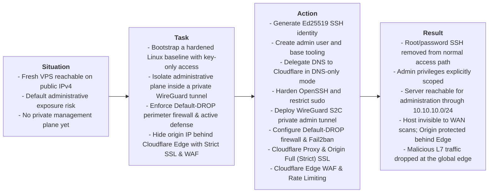

# Overview

> **Domain**: Infrastructure Security, Linux Administration, Network Hardening
>
> **Technologies**: AlmaLinux, Cloudflare DNS & WAF, WireGuard VPN, OpenSSH, iptables, Fail2ban
>
> **Methodology**: S.T.A.R. Framework (Situation, Task, Action, Result)

---

## Executive Summary (S.T.A.R. Breakdown)

---

* **Situation**: I instantiated a fresh Linux VPS with a public IP. Out of the box, it's wide open, root login enabled, `password auth on`, no firewall, nothing hiding it from bots scanning the internet 24/7.
* **Task**: Lock the server down before putting anything else on it: eliminate root/password remote access, isolate administration inside a private WireGuard tunnel, enforce a Default-DROP host firewall with automated intrusion defense and hide the origin IP behind Cloudflare with Full (Strict) SSL and Edge WAF filtering.
* **What I did**:
  1. Generated an SSH key (`Ed25519`) and set up a non-root user to use instead of root.
  2. Updated the OS and installed the basic tools I'd need (`curl`, `jq`, `chrony for clock sync`, etc).
  3. Pointed my domain's DNS to the server through Cloudflare.
  4. Turned off root login and password login over SSH, key-only from here on. Also stripped the admin user's sudo down to only the specific commands it needs, instead of full `wheel` access.
  5. Set up a WireGuard VPN so I can SSH into the server from a private tunnel instead of the public internet.
  6. Locked the firewall to deny everything by default, only allowing VPN traffic in. Added Fail2ban so repeated failed login attempts get auto-banned.
  7. Put Cloudflare in front as a reverse proxy so the server's real IP is never exposed, and enabled Full (Strict) SSL so traffic between Cloudflare and the server is encrypted end-to-end.
  8. Configured Cloudflare Edge WAF custom rules (geo-blocking, malicious User-Agent filtering, sensitive path protection) and Rate Limiting to filter attack traffic before it reaches the VPS.
* **Result**:
  * Only my SSH key works, no root, no passwords, nowhere for a brute-force attack to land.
  * Sudo access is scoped down to exactly what's needed, written down in an auditable file, not "full admin forever."
  * I can only manage the server from inside the VPN. Anyone scanning the public IP finds nothing open.
  * Failed login attempts get auto-blocked, and my own VPN IP range is whitelisted so I never lock myself out.
  * The server's real IP is hidden behind Cloudflare and all traffic to it is encrypted so even the "front door" isn't directly exposed anymore.
  * Layer 7 attacks, automated scanners, and abusive bursts are blocked at Cloudflare's global edge without consuming VPS resources.

---

### Guiding Principle: Defense-in-Depth
 
This architecture was built around the idea that **no individual control should be trusted as the sole barrier**. Each layer: identity, network, firewall, intrusion detection, edge proxy, and edge WAF; assumes the layer before it could fail and is designed to contain the breach on its own.
 
If an SSH key were somehow leaked, it would still be useless without VPN access. If the VPN were compromised, the firewall would still block lateral movement. If the firewall had a misconfiguration, Cloudflare would still shield the origin IP and filter malicious payloads at the edge. This layered redundancy is what turns a single hardened server into a resilient perimeter.

How these layers map to CIS Controls and NIST CSF is in the [README controls mapping](../../README.md#controls-mapping). Role-level notes (NIS2/RJC, QNRCS) are in [cybersecurity-officer](https://github.com/gabzaf/cybersecurity-officer).
 
---

### Progress Trail
`SSH Identity` → `System Base` → `DNS (Cloudflare)` → `SSH Hardening` → `WireGuard VPN` → `Private-only Admin` → `Perimeter Firewall` → `Monitoring / Fail2ban` → `Cloudflare Proxy` → `Full (Strict) SSL` → `Cloudflare WAF`

This project is split into five phase documents, meant to be read in order, each phase builds directly on the access model established by the previous one.

| Phase | Document | Focus Area |
| :---: | :--- | :--- |
| **1** | [**01-identity-dns.md**](./01-identity-dns.md) | SSH key generation, base OS setup, Cloudflare DNS delegation |
| **2** | [**02-ssh-vpn-hardening.md**](./02-ssh-vpn-hardening.md) | SSH hardening, sudo scoping, WireGuard VPN, private-only admin access |
| **3** | [**03-firewall-monitoring.md**](./03-firewall-monitoring.md) | Perimeter firewall (iptables), Fail2ban intrusion detection |
| **4** | [**04-cloudflare-tls.md**](./04-cloudflare-tls.md) | Cloudflare reverse proxy, origin certificate, Full (Strict) SSL |
| **5** | [**05-cloudflare-waf.md**](./05-cloudflare-waf.md) | Edge WAF Custom Rules, Managed Ruleset, Rate Limiting & Edge Security |

 **[Start with Phase 1: Identity & DNS](./01-identity-dns.md)**
