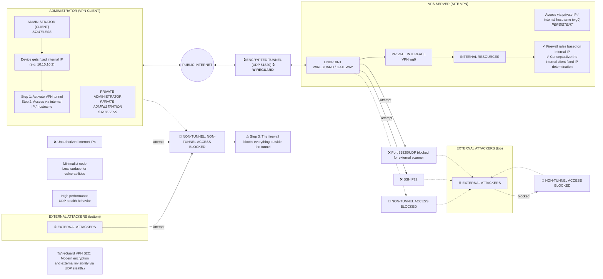

# Phase 2: SSH & VPN Hardening

[← Phase 1: Identity & DNS](./01-identity-dns.md) · **Phase 2 of 4** · [Next: Firewall & Monitoring →](./03-firewall-monitoring.md)

---

### In this phase
- [4. Admin Access Hardening (`/etc/ssh/sshd_config.d`)](#4-admin-access-hardening-etcsshsshd_configd)
  - [sudo Restriction](#sudo-restriction)
- [5. VPN Site-to-Client (S2C) and Private Administration](#5-vpn-site-to-client-s2c-and-private-administration)
  - [WireGuard Adopted Architecture](#wireguard-adopted-architecture)
  - [1. Connect via SSH](#1-connect-via-ssh)
  - [2. WireGuard Installation](#2-wireguard-installation)
  - [3. Server Side](#3-server-side)
  - [4. Client Side](#4-client-side)
  - [5. Start the VPN](#5-start-the-vpn)
- [6. Admin Device Configuration (Client)](#6-admin-device-configuration-client)
  - [Tunnel Lifecycle (connect and disconnect)](#tunnel-lifecycle-connect-and-disconnect)
  - [Connectivity Validation and Diagnostics](#connectivity-validation-and-diagnostics)
- [7. Exclusively Private Administration](#7-exclusively-private-administration)

---

## Configuration Artifacts & Reference Code

### 4. Admin Access Hardening (`/etc/ssh/sshd_config.d`)
This configuration neutralizes the two primary attack surfaces in administrative access: a permissive SSH daemon and direct remote root execution.

SSH is the server's administrative gateway. If this gateway is poorly protected, the rest of the infrastructure is irrelevant. Firewalls, VPNs and reverse proxies don't compensate for exposed administrative access.

Automated attacks exploit exactly three recurring vulnerabilities:
- Remote login as root;
- Authentication via password exposed to the internet;
- Permissive or implicit configuration of sshd.

<details>
<summary><b>▶ View config — sshd_config hardening</b></summary>

Create or update `/etc/ssh/sshd_config.d/01-hardening.conf`:
```sshd_config
# It only forces cryptographic keys; it prohibits passwords and interactivity
AuthenticationMethods publickey
PubkeyAuthentication yes
PasswordAuthentication no
KbdInteractiveAuthentication no
ChallengeResponseAuthentication no
PermitEmptyPasswords no

# Prohibit remote login as root, whether using a password or a key
PermitRootLogin no

# Restricts access exclusively to administrative users
AllowUsers <username>

# Ends idle sessions (5 minutes of inactivity)
ClientAliveInterval 300
ClientAliveCountMax 0

# Disables unnecessary tunnels and redirects
X11Forwarding no
AllowTcpForwarding no
AllowAgentForwarding no

# Structured Audit Logging
LogLevel VERBOSE
```

- `AuthenticationMethods publickey`: blocks any authentication attempts by other means.
- `PasswordAuthentication no`: blocks brute-force password attacks.
- `PermitRootLogin no`: prevents remote login as root even with a valid key.
- `AllowUsers <username>`: restricts the daemon to accept connections only from the `<username>` user.
- `AllowTcpForwarding no`: disables port forwarding via SSH.
- `PubkeyAuthentication yes`: explicitly enforces allowing only key authentication.
- `PermitEmptyPasswords no`: ensures accounts with empty passwords cannot authenticate.
- `ChallengeResponseAuthentication no`: disables challenge-response authentication.

> [!IMPORTANT]
> Never restart SSH without validating first and keep one SSH session open while testing another.
</details>

#### `sudo` Restriction

With root blocked via SSH and `<username>` as the only access to the server, unrestricted sudo is the next step. The `<username>` user has been in the `wheel` group (AlmaLinux) since its creation — meaning any command can be executed as root, or anything an attacker wants to run if they compromise the account.

The principle adopted: `<username>` only has standard access, and permissions are granted exactly as required. Nothing more.

<details>
<summary><b>▶ View commands — granular sudo restriction</b></summary>

Before removing it from the group, I create a dedicated `sudoers` file for `<username>`. If I remove it first, I lose the ability to execute any privileged commands.

Log in directly as root:

> [!WARNING]
> From now on, I will be operating as root until I run `exit`. Use it only for specific administrative tasks that granular sudoers does not cover.

```bash
su -
```

Create and populate the `sudoers` file:
```bash
visudo -f /etc/sudoers.d/ops
```
```text
# Service management
<username> ALL=(root) NOPASSWD: /usr/bin/systemctl

# Log reading
<username> ALL=(root) NOPASSWD: /usr/bin/journalctl

# Package installation and updates (AlmaLinux)
<username> ALL=(root) NOPASSWD: /usr/bin/dnf
```

With these restrictions, the `<username>` user can manage services and install or update system packages, but cannot modify system configurations outside these binaries or execute arbitrary privileged commands.

Save and validate the syntax:
```bash
visudo -cf /etc/sudoers.d/ops
```
Expected output:
```text
/etc/sudoers.d/ops: parsed OK
```

Confirm the actual account privilege inventory:
```bash
sudo -l -U ops
```
Expected output:
```text
User <username> may run the following commands:
(root) NOPASSWD: /usr/bin/systemctl
(root) NOPASSWD: /usr/bin/journalctl
(root) NOPASSWD: /usr/bin/dnf
```

If anything appears beyond the entries defined, investigate before continuing. Now remove `<username>` from the unrestricted sudo group:
```bash
# AlmaLinux
gpasswd -d ops wheel
```

Finally, end the `root` user session:
```bash
exit
```

Now, start a new SSH connection without any active root session:
```bash
ssh -i ~/.ssh/my_key <username>@srv01.mysite.com
```

Invalidate any residual authentication cache and confirm the lock:
```bash
sudo -k
sudo whoami
```

**Adding entries to sudoers in the future**

Whenever I have a requisition to a new privilege for `<username>`, the flow is the same:
```bash
su -
visudo -f /etc/sudoers.d/ops
visudo -cf /etc/sudoers.d/ops
exit
```
</details>

#### Expected end state
At this point:
- Only the `<username>` user accesses the server exclusively via SSH key;
- No passwords travel over the network;
- `root` is inaccessible remotely;
- The scope of sudo is restricted to the minimum necessary for this phase, with controlled expansion as required;
- SSH authentication logs are auditable.

---

### 5. VPN Site-to-Client (S2C) and Private Administration
This section isolates server management from the internet, creating an encrypted tunnel that makes the infrastructure invisible to external scans and limits access only to authorized devices.

Even with key-protected SSH and root blocked, exposing the administrative port to the public internet is an unnecessary risk. Bots don't "try passwords," they map, enumerate and correlate patterns. The VPN adds a network layer on top of the identity layer I've already protected: the server stops responding to any internet IP except for traffic traveling inside the tunnel.

#### VPN Site-to-Client (S2C)
Unlike a commercial VPN (which serves to hide my browsing), an S2C VPN connects the administrator to the server's internal network. The **Server (Site)** acts as the private endpoint. The **Administrator (Client)** connects to the server via an encrypted tunnel. My device gains a fixed internal IP address (e.g., `10.10.10.2`), allowing for extremely restrictive firewall rules — even when connected to public Wi-Fi or third-party networks.

#### WireGuard Adopted Architecture



I use the WireGuard protocol for Site-to-Client (S2C) VPN implementation. It is minimalist in code, meaning less surface area for vulnerabilities. It comes with modern encryption via **Curve25519** and has **UDP stealth** behavior that does not respond to port scans. To an external scanner, port 51820/UDP is indistinguishable from a blocked port.

The new access flow after completing this module:
5.1. Activate the VPN tunnel on my computer.
5.2. Access the server via private IP or internal hostname.
5.3. The firewall will block any access attempts that do not originate from the tunnel.

#### 1. Connect via SSH

#### 2. WireGuard Installation
<details>
<summary><b>▶ View commands — WireGuard installation</b></summary>

```bash
sudo dnf install -y epel-release
sudo dnf install -y wireguard-tools
```
</details>

#### 3. Server Side

##### 3.1 Keys Generation
<details>
<summary><b>▶ View commands — server key generation</b></summary>

On the server, generate the key pair:
```bash
cd /etc/wireguard
```
Generate the security keys:
```bash
sudo bash -c "umask 077; wg genkey | tee server.key | wg pubkey > server.pub"
```
- `umask 077`: sets default permission 600 for root so the private and public keys are created closed from the source (official WireGuard recommendation).
- `wg genkey`: generates a random private key using Curve25519 — the "master secret."
- `tee server.key`: saves the key to `server.key` and simultaneously sends it to the next command via pipe.
- `wg pubkey`: computes the corresponding public key. Only the public key is shared; the private key MUST never leave the server.

Keys generated:
- `server.key`: Server private identity (never share)
- `server.pub`: Server public identity
</details>

##### 3.2 VPN Interface Configuration `wg0`
<details>
<summary><b>▶ View config — wg0.conf (server)</b></summary>

Create the file `/etc/wireguard/wg0.conf`:
```bash
sudo nano /etc/wireguard/wg0.conf
```
```text
[Interface]
Address = 10.10.10.1/24
ListenPort = 51820
PrivateKey = <SERVER_CONTENT.KEY>

# Enable packet forwarding
PostUp = sysctl -w net.ipv4.ip_forward=1
PostDown = sysctl -w net.ipv4.ip_forward=0
```
- `Address = 10.10.10.1/24`: internal IP of the server on the private network (up to 253 clients).
- `ListenPort = 51820`: UDP port where the server listens. WireGuard is silent — it does not respond to port scanners unless the client sends a valid key.
- `PostUp` / `PostDown`: enable/disable IP forwarding as the VPN goes up/down, preventing network "leaks".

> [!IMPORTANT]
> - `10.10.10.0/24` is an administration-only network;
> - Do not reuse network ranges from my home LAN;
> - `wg0` does not automatically expose services.
</details>

##### 3.3 Firewall Configuration (Server)
WireGuard uses UDP 51820 by default. Even with the interface correctly configured, `firewalld` will silently drop this traffic unless explicitly allowed — and because WireGuard doesn't send error responses, this failure is invisible: no errors, just zero handshake and zero bytes received.

<details>
<summary><b>▶ View commands — opening UDP port 51820</b></summary>

Open the port:
```bash
sudo firewall-cmd --permanent --add-port=51820/udp && sudo firewall-cmd --reload
```
Verify:
```bash
sudo firewall-cmd --list-all
```
I should see `51820/udp` listed under ports:.
</details>

#### 4. Client Side
In addition to generating the keys, I need the software to run the tunnel — otherwise my computer wouldn't know how to "speak" the WireGuard protocol or create the virtual network interface.

<details>
<summary><b>▶ View commands — client installation</b></summary>

```bash
sudo apt update 
sudo apt upgrade -y && sudo apt install wireguard-tools
```
</details>

##### 4.1 Keys Generation
> [!WARNING]
> **Attention**: Do not generate client keys within the server. Generate them on my local machine so my private key never touches the network.

<details>
<summary><b>▶ View commands — client key generation</b></summary>

On my local computer, generate the client keys by running:
```bash
wg genkey | tee client.key | wg pubkey > client.pub
```
Generated keys:
- `client.key`: My VPN private key. This goes in my local configuration file
- `client.pub`: My VPN public key. This goes in the server's `wg0.conf` file to be registered on the server
</details>

##### 4.2 Client Registration on Server
<details>
<summary><b>▶ View config — [Peer] block on the server</b></summary>

Now that I have the `client.pub`, I go back to the server and add the `[Peer]` block to the end of the `/etc/wireguard/wg0.conf` file:
```text
[Peer]
# Generated public key in my computer (client.pub)
PublicKey = <CLIENT_CONTENT.PUB>

# The fixed IP address that this device will have within the VPN tunnel.
AllowedIPs = 10.10.10.2/32
```
Each customer receives a fixed IP and a `/32` block.
</details>

---

#### 5. Start the VPN
<details>
<summary><b>▶ View commands — bringing up the wg0 interface</b></summary>

In the server, start the interface and ensure it goes up during boot:
```bash
sudo systemctl enable wg-quick@wg0
sudo systemctl start wg-quick@wg0
```
- `systemctl enable wg-quick@wg0`: `@wg0` tells the system to look for the `wg0.conf` file; ensures the VPN comes up automatically on restart.
- `systemctl start wg-quick@wg0`: activates the virtual network interface immediately.

Verify:
```bash
wg show
ip a show wg0
```
Expected state: active `wg0` interface, listed peer, recent handshake after client connection.
</details>

---

### 6. Admin Device Configuration (Client)
In order for my notebook to "see" the server through the tunnel, I must create a local configuration file.

<details>
<summary><b>▶ View config — vps-admin.conf (client)</b></summary>

Create the config file:
```bash
sudo nano /etc/wireguard/vps-admin.conf
```
File in the client:
```text
[Interface]
PrivateKey = <CLIENT_CONTENT.key>
Address = 10.10.10.2/32

[Peer]
PublicKey = <SERVER_CONTENT.pub>
# ATTENTION: Use a subdomain which always points to the public IP (ex: vpn.mydomain.com)
Endpoint = vpn.mydomain.com:51820
AllowedIPs = 10.10.10.0/24
PersistentKeepalive = 25
```

> [!IMPORTANT]
> In Cloudflare, make sure to create the `vpn.mydomain.com` record pointing to the VPS's Public IP (Gray Cloud).

- `PrivateKey`: the private key generated ON MY COMPUTER (`client.key`)
- `Address = 10.10.10.2/32`: my device's identity on the internal network — unique to this host.
- `PublicKey`: the SERVER's public key (`server.pub`)
- `Endpoint = vpn.mydomain.com:51820`: indicates where the client should "knock on the door".
- `AllowedIPs = 10.10.10.0/24`: only traffic destined for the `10.10.10.x` network goes through the VPN; everything else keeps using normal internet (Split Tunneling).
- `PersistentKeepalive = 25`: sends an invisible "hello" every 25 seconds to keep the tunnel open, since WireGuard is silent and ISP firewalls may forget it due to inactivity.
</details>

#### Tunnel Lifecycle (connect and disconnect)
Unlike background services, administrative VPN should be used on demand.

<details>
<summary><b>▶ View commands — connect/disconnect and diagnostics</b></summary>

🟢 **To connect via the terminal**:
```bash
sudo wg-quick up vps-admin
```
Example of successful output:
```text
[#] ip link add vps type wireguard
[#] wg setconf vps /dev/fd/63
[#] ip -4 address add 10.10.10.2/32 dev vps
[#] ip link set mtu 65456 up dev vps
[#] ip -4 route add 10.10.10.0/24 dev vps
```

🔴 **To disconnect**:
```bash
sudo wg-quick down vps-admin
```

#### Connectivity Validation and Diagnostics

Execute on the client, with the VPN connected:
```bash
# Internal Connectivity Test
ping 10.10.10.1
```
View interface:
```bash
ip -br a show vps-admin
```
If "UP" appears along with the IP address `10.10.10.2/32`, the local interface is ready.

Execute on the server:
```bash
sudo wg show
```
Example of a successful output:
```text
interface: wg0
  public key: t4hdnhP1Yk24XB5+GF+F+jExaZRbZFFllx1cJurIeRQ=
  private key: (hidden)
  listening port: 51820

peer: O3Ds/iKeVYnx5YfnAwRqPFvJYw0llPWKcaML22OwL0M=
  endpoint: srv01.mydomain.com:51820
  allowed ips: 10.10.10.2/32
  latest handshake: 1 minute, 14 seconds ago
  transfer: 4.12 KiB received, 2.98 KiB sent
```
- `latest handshake`: if this line does not appear, the connection was not established (WireGuard fails silently on wrong keys).
- `endpoint`: the actual destination currently connected to — should confirm my VPS server.
- `transfer`: confirms real data (like my ping) traveled through the tunnel.
</details>

---

### 7. Exclusively Private Administration

> [!IMPORTANT]
> Test SSH access through the VPN tunnel on another terminal, while leaving the other connected tab open.

Instead of accessing via IP, I create an official DNS record for internal management — the Split-Horizon DNS concept (pointing the public DNS name to a private IP of my VPN, `10.10.10.1`). This ensures traffic leaves my laptop, enters the VPN tunnel and goes directly to the server, without going around the public internet.

<details>
<summary><b>▶ View steps — Split-Horizon DNS and validation</b></summary>

Go to the Cloudflare DNS panel and CHANGE the record for the previously created administrative subdomain, from my VPS's public IP to my VPN's local IP:

| Type | Name  | Value       | Proxy                         | Destination          |
|:----:|:------|:------------|:------------------------------|:---------------------|
| **A** | `srv01` | `10.10.10.1` | DNS Only (⚠️ Grey Cloud)      | `srv01.mysite.com`   |

When I try to access `srv01.mysite.com` while on the VPN, my computer will resolve to `10.10.10.1`. Because I am connected to the VPN, it will find the route. Anyone outside the VPN will try to access this private IP address and will fail.

Now, connect my SSH terminal using the name and not the IP address:
```bash
ssh -i ~/.ssh/my_key <username>@srv01.mysite.com
```

🟢 If I log in, congratulations: I have created a domain that only exists for those who have access to my VPN and are ready to permanently close public port 22 via the firewall.

> [!IMPORTANT]
> Alternatively, I can still access it directly via internal IP using a VPN connection:
```bash
ssh -i ~/.ssh/sua_chave <username>@10.10.10.1
```
</details>

From now on, this will be my only way to manage the server from the next steps onwards.

---

[← Phase 1: Identity & DNS](./01-identity-dns.md) · **Phase 2 of 4** · [Next: Phase 3 — Firewall & Monitoring →](./03-firewall-monitoring.md)
