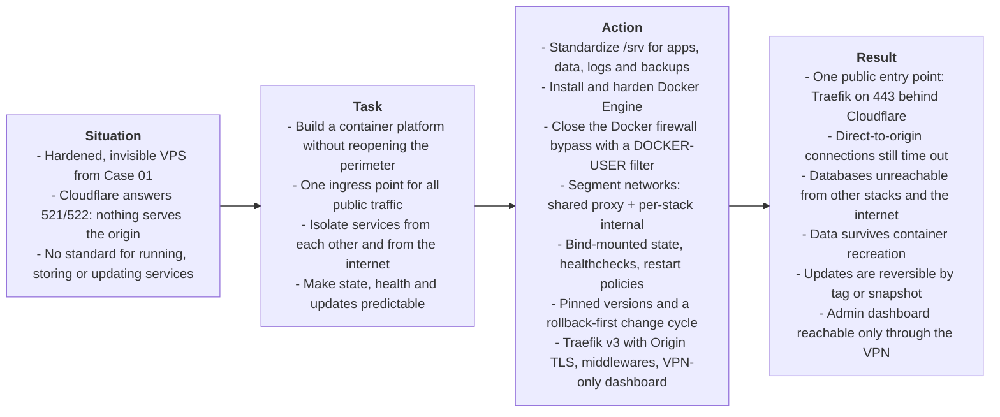

# Overview

> **Domain**: Container Platform Engineering, Network Segmentation, Ingress Security
>
> **Technologies**: AlmaLinux, Docker Engine & Compose, iptables (`DOCKER-USER`), Traefik v3, Cloudflare Origin CA
>
> **Methodology**: S.T.A.R. Framework (Situation, Task, Action, Result)
>
> **Builds on**: [Case 01 — Perimeter Foundation & Zero-Trust Administration](../case-01-perimeter-foundation-and-zero-trust-admin/00-overview.md)

---

## Executive Summary (S.T.A.R. Breakdown)

---

* **Situation**: After Case 01 the server is locked down: key-only SSH through a private WireGuard tunnel, a default-DROP firewall that only lets Cloudflare reach ports 80/443 and the origin IP hidden behind Cloudflare. It's secure, but it serves nothing. Browsing the domain returns a Cloudflare 521/522 error because no service is listening on the origin.
* **Task**: Turn the hardened host into a platform that can run services, without undoing anything Case 01 closed. Every public request must enter through a single, TLS-terminating ingress point. Services must be isolated from each other and from the internet. Their state must live in a fixed location under `/srv/data`, their health must be measured instead of assumed and every update must have a way back.
* **What I did**:
  1. Defined a production layout under `/srv` (`apps`, `data`, `logs`, `backups`) with explicit ownership and permissions, so I always know where configuration and state live.
  2. Installed Docker Engine from Docker's official repository and hardened the daemon: log rotation, `live-restore`, `icc` off, `no-new-privileges` and file-descriptor limits.
  3. Proved that ports published by Docker skip the `INPUT` chain my Case 01 firewall relies on, then closed that gap with a Cloudflare-only filter in Docker's `DOCKER-USER` chain that fails closed and reloads on boot.
  4. Segmented the container networks: one shared `proxy` network for what Traefik must reach, and a separate internal network per stack, with no internet access, for databases and caches.
  5. Kept persistent state in bind mounts under `/srv/data` and solved the UID-permission model, so containers can be destroyed and recreated without losing data.
  6. Added healthchecks, `unless-stopped` restart policies and health-gated startup ordering, so `Up` means *working*, not just *running*.
  7. Defined a change cycle for updates (prepare → execute → validate → confirm or roll back) built on pinned image tags and snapshots.
  8. Deployed Traefik v3 as the single ingress: Cloudflare Origin certificate with TLS 1.2+, global HTTP→HTTPS redirect, nothing exposed unless explicitly labeled, reusable middlewares (security headers, VPN allow-list, rate limiting keyed on the real client IP) and a dashboard reachable only through the VPN.
* **Result**:
  * There's exactly one public entry point: Traefik on port 443, reachable only through Cloudflare. No other container answers from the internet, even if I publish a port by mistake.
  * Direct connections to the origin IP still time out after Docker starts managing its own firewall rules, so Case 01's origin protection holds.
  * A database on an internal network can't be reached by other stacks and can't reach the internet.
  * Data lives in `/srv/data` and survives container recreation; backups are a plain directory copy.
  * A container that hangs or stops answering is marked `unhealthy` instead of looking fine, and dependent services wait until their dependencies are actually ready.
  * Updates are reversible: switch back to the previous tag, or restore the snapshot if data is involved.
  * Publishing a new service is a few labels and `docker compose up -d`: no firewall change, no proxy restart.
  * The Traefik dashboard only exists inside the VPN. Even if a request for it arrived through Cloudflare, the allow-list would reject it with `403`.

---

### Guiding Principle: Nothing Is Exposed Unless It Is Declared

This platform is built so that **exposure is always an explicit, reviewable decision, never a side effect**. Every layer defaults to closed and requires a deliberate declaration to open:

- a container isn't routed by Traefik unless it carries `traefik.enable=true`;
- a published port doesn't reach the internet unless the source is Cloudflare and the port is 80/443;
- a database isn't reachable unless it shares an internal network with the one service that needs it;
- an admin interface isn't reachable unless the request comes from the VPN range.

The layers also back each other up. If I publish a database port by mistake, the `DOCKER-USER` filter still drops it at the WAN. If a container is compromised, its internal network gives it no route to other stacks or to the internet. If a route for an admin tool leaks to the public side, the VPN allow-list returns `403`. That's the same defense-in-depth logic as Case 01, moved from the host perimeter into the platform.

How these controls map to CIS Controls and NIST CSF is in the [README controls mapping](../../README.md#controls-mapping).

---

### Progress Trail
`/srv Layout` → `Docker Engine` → `Daemon Hardening` → `DOCKER-USER Filter` → `Network Segmentation` → `Persistent State` → `Health & Restart` → `Change Cycle` → `Traefik v3` → `Origin TLS` → `Middlewares` → `VPN-only Dashboard`

This case is split into five phase documents, meant to be read in order. Each phase builds on the platform guarantees established by the previous one.

| Phase | Document | Focus Area |
| :---: | :--- | :--- |
| **1** | [**01-srv-layout-docker-engine.md**](./01-srv-layout-docker-engine.md) | Production directory layout, Docker Engine installation and daemon hardening |
| **2** | [**02-docker-firewall.md**](./02-docker-firewall.md) | Why published ports bypass `INPUT`, Cloudflare-only `DOCKER-USER` filter, persistence |
| **3** | [**03-networks-state.md**](./03-networks-state.md) | Network segmentation, internal networks, bind-mounted state and permissions |
| **4** | [**04-health-change-cycle.md**](./04-health-change-cycle.md) | Healthchecks, restart policies, dependencies, pinned versions and rollback |
| **5** | [**05-traefik-ingress.md**](./05-traefik-ingress.md) | Traefik v3, Origin TLS, middlewares, service exposure and the VPN-only dashboard |

 **[Start with Phase 1: Production Layout & Docker Engine](./01-srv-layout-docker-engine.md)**
