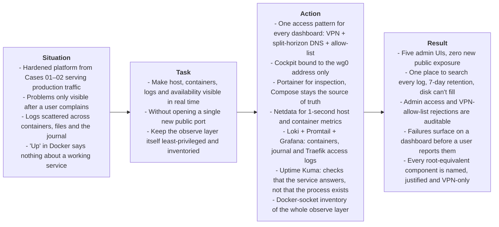

# Overview

> **Domain**: Observability, Security Logging & Monitoring, Availability Engineering
>
> **Technologies**: AlmaLinux, Cockpit, Portainer CE, Netdata, Grafana Loki, Promtail, Grafana, Uptime Kuma, systemd-journald, Traefik v3
>
> **Methodology**: S.T.A.R. Framework (Situation, Task, Action, Result)
>
> **Builds on**: [Case 02 — Segmented Container Platform & Traefik Ingress](../case-02-container-platform-and-traefik-ingress/00-overview.md)

---

## Executive Summary (S.T.A.R. Breakdown)

---

* **Situation**: After Case 02 the platform serves the client's production site through a single, filtered ingress. It's secure, but it's a black box. When something degrades, I find out from a user, then SSH in and read `docker logs` container by container, plus the journal, plus Traefik's access log file. Container logs disappear when a container is recreated. And Docker's `Up` status only says a process exists, not that the site answers.
* **Task**: Make the host, the containers, the logs and the availability of every service visible in real time, without undoing anything Cases 01–02 closed. No dashboard may be reachable from the internet. Logs must be searchable in one place, with retention that can't fill the disk. And the observe layer itself must follow the same least-privilege rules as the platform it watches.
* **What I did**:
  1. Defined one access pattern for every administrative UI: a split-horizon DNS name that resolves to the WireGuard address, a Traefik router behind the `vpn-allowlist` middleware, and the Origin CA trusted on the admin device only.
  2. Installed **Cockpit** as the host view and bound it to the WireGuard address, so it doesn't depend on the firewall alone and never listens on the public interface.
  3. Deployed **Portainer** for container inspection. Compose files under `/srv/apps` stay the source of truth; Portainer is for looking, not for deploying.
  4. Deployed **Netdata** for 1-second host and per-container metrics, and documented exactly which privileges it needs and why.
  5. Built a log pipeline with **Loki, Promtail and Grafana**: container output, the systemd journal (sshd, sudo, Fail2ban, kernel) and Traefik's JSON access log, on an internal network with no internet access, with 7-day retention.
  6. Wrote the LogQL queries a security reviewer would ask for first: admin logins, sudo commands, Fail2ban bans, VPN-allow-list rejections, 5xx spikes and the clients behind 4xx bursts.
  7. Deployed **Uptime Kuma** to check the full public path and each container's health, without adding any container to a network it doesn't need.
  8. Reviewed the observe layer as a security surface: five containers hold the Docker socket, so I listed each one, what it needs it for and what limits the risk.
* **Result**:
  * Five administrative UIs exist, and none of them is reachable without the VPN. Not a single port was opened on the public side.
  * Every container log, the host journal and every HTTP request are searchable in one place, for 7 days, with automatic cleanup.
  * Admin activity leaves a trail: every SSH login and every `sudo` command can be found in seconds. Because WAN `:22` is dropped before `sshd` (Case 01), that trail shows legitimate admin access, not internet noise.
  * Requests that reach an admin router from outside the VPN show up as `403` per router, so a leaked route is visible, not silent.
  * Load, memory pressure, disk and per-container usage are visible at 1-second granularity.
  * The public site is checked end to end through Cloudflare, and each container's health is checked through the Docker API.
  * Every root-equivalent component of the observe layer is named, justified and reachable only through the VPN.

---

### Guiding Principle: Observe Without Opening

Observability tools are some of the most privileged software on a server: they read every log, see every process and often hold the Docker socket. So this case treats them as **part of the administrative plane, never as part of the public service**:

- every dashboard resolves only to `10.10.10.1`, which isn't routable without the WireGuard tunnel;
- every Traefik router for a dashboard carries `vpn-allowlist@file`, so even a request that reaches Traefik from anywhere else gets `403`;
- the log store has no route to the internet and isn't on the `proxy` network at all;
- the components that need the Docker socket are listed, justified and reviewed, because each of them is root-equivalent.

That's the same rule as Cases 01 and 02, applied to the tools that watch them: **nothing is exposed unless it's declared, and nothing privileged is accepted without being named.**

How these controls map to CIS Controls and NIST CSF is in the [README controls mapping](../../README.md#controls-mapping).

---

### The Observe Layer at a Glance

| Tool | Answers | Published as | Holds the Docker socket |
| :--- | :--- | :--- | :---: |
| **Cockpit** | How is the host doing? (systemd, disks, journal) | Host service on `10.10.10.1:9090` | No |
| **Portainer** | What are the containers doing? | Traefik router + `vpn-allowlist` | Yes |
| **Netdata** | How much CPU, memory, disk and network, per second? | Traefik router + `vpn-allowlist` | Yes |
| **Loki + Promtail + Grafana** | What happened, and when? | Grafana: Traefik router + `vpn-allowlist`; Loki: not published | Promtail |
| **Uptime Kuma** | Is it actually answering? | Traefik router + `vpn-allowlist` | Yes |

<!-- TODO(screenshot): grafana-dashboard.png -->

---

### Progress Trail
`Observability Model` → `VPN-only Access Pattern` → `Cockpit on wg0` → `Portainer` → `Netdata` → `Log Pipeline` → `Journal & Access Logs` → `Retention` → `Security Queries` → `Uptime Kuma` → `Docker-Socket Review`

This case is split into five phase documents, meant to be read in order. Each phase builds on the access pattern defined in Phase 1.

| Phase | Document | Focus Area |
| :---: | :--- | :--- |
| **1** | [**01-observability-model-access.md**](./01-observability-model-access.md) | What to observe, which signals matter first, and the VPN-only access pattern every dashboard reuses |
| **2** | [**02-host-and-container-views.md**](./02-host-and-container-views.md) | Cockpit bound to the WireGuard address, and Portainer for container inspection |
| **3** | [**03-metrics-netdata.md**](./03-metrics-netdata.md) | Netdata host and container metrics, and the privileges it needs |
| **4** | [**04-centralized-logs.md**](./04-centralized-logs.md) | Loki, Promtail and Grafana: containers, journal and Traefik access logs, retention and security queries |
| **5** | [**05-availability-socket-review.md**](./05-availability-socket-review.md) | Uptime Kuma availability checks, and a security review of every Docker-socket consumer |

 **[Start with Phase 1: Observability Model & Access Pattern](./01-observability-model-access.md)**
