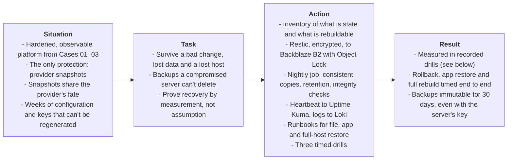

# Overview

> **Domain**: Backup & Recovery, Disaster Recovery, Ransomware Resilience, Change Management
>
> **Technologies**: AlmaLinux, Restic, Backblaze B2 (S3 API, Object Lock), systemd timers, provider snapshots, Uptime Kuma push monitors, Grafana Loki
>
> **Methodology**: S.T.A.R. Framework (Situation, Task, Action, Result)
>
> **Builds on**: [Case 03 — VPN-only Observability](../case-03-observability-metrics-logs-availability/00-overview.md)

---

## Executive Summary (S.T.A.R. Breakdown)

---

* **Situation**: After Case 03 the platform is hardened and observable, but its only safety net is the provider's snapshots. A snapshot is excellent for undoing a change, and useless if the provider account, the region or the snapshot itself is lost. The client's site holds no data of its own, so what's at stake is the platform: weeks of configuration under `/srv/apps` and `/etc`, the WireGuard and Origin certificate keys, and the history the observe layer has collected. Nothing proves any of it could be rebuilt.
* **Task**: Be able to recover from three different kinds of loss: a bad change, lost data on a working host, and the host itself gone. Backups must live outside the VPS provider, be encrypted before they leave the server, and survive a compromised server that tries to delete them. And recovery must be *measured* in drills, not assumed from a green backup job.
* **What I did**:
  1. Inventoried the server's state: what must be backed up, what can be rebuilt from the cases, and what deliberately isn't kept.
  2. Set recovery objectives per scenario, instead of one number for everything.
  3. Created a private Backblaze B2 bucket with **Object Lock** (30-day governance retention) and an application key scoped to that bucket only.
  4. Set up **Restic** with client-side encryption, a password and credentials kept in files the server can read and an offline copy only I hold.
  5. Wrote a nightly backup job that briefly stops the containers whose databases would otherwise be copied mid-write, then applies retention and checks repository integrity on a schedule.
  6. Connected the job to Case 03: it reports to an Uptime Kuma push monitor and logs to the journal, so a backup that didn't run, or failed, is visible.
  7. Wrote three restore runbooks: one file, one application's data, and a full rebuild on a new host from offsite backups only.
  8. Ran three timed drills and recorded what happened, including what broke.
* **Result** (from the drills in [Phase 4](./04-recovery-drills.md)):

| Drill | Scenario | Target | Measured |
| :---: | :--- | :--- | :--- |
| **D1** | Failed release of the client site, rolled back | < 60 s | <!-- TODO(drill): D1 result --> _pending_ |
| **D2** | One application's data deleted, restored from B2 | < 10 min, RPO ≤ 24 h | <!-- TODO(drill): D2 result --> _pending_ |
| **D3** | Host lost, rebuilt on a new VPS from B2 only | < 2 h, RPO ≤ 24 h | <!-- TODO(drill): D3 result --> _pending_ |

---

### Guiding Principle: A Backup Is Only a Hypothesis Until It's Restored

A backup job that reports success has proven one thing: it wrote files. It hasn't proven that the files are complete, that the password still exists, that the restore order works, or that the restored services start. Those failures only show up when something is restored, so this case treats **the restore as the product and the backup as a means to it**:

- every scenario has a written runbook *and* a drill that executed it, with timestamps;
- the drill's numbers are the recovery objectives that this case claims, not the targets;
- whatever broke during a drill is written down and fixed, because that's the failure the real incident would have hit.

The same defense-in-depth logic as Cases 01–03 applies to the backups themselves: encrypted before they leave, stored with a different provider, and immutable for 30 days, so a compromised server can't take its own backups down with it.

How these controls map to CIS Controls and NIST CSF is in the [controls mapping](../../docs/controls-mapping.md#34-case-04-backups-and-recovery-planned).

---

### Progress Trail
`Failure Modes` → `State Inventory` → `Recovery Objectives` → `B2 Bucket & Object Lock` → `Restic Repository` → `Nightly Job` → `Retention & Checks` → `Heartbeat & Logs` → `Restore Runbooks` → `D1 Rollback` → `D2 App Restore` → `D3 Full Rebuild`

This case is split into four phase documents, meant to be read in order.

| Phase | Document | Focus Area |
| :---: | :--- | :--- |
| **1** | [**01-recovery-model.md**](./01-recovery-model.md) | What can go wrong, what is state, recovery objectives, snapshots vs backups |
| **2** | [**02-restic-b2-backups.md**](./02-restic-b2-backups.md) | B2 bucket with Object Lock, Restic repository, nightly job, retention, integrity and monitoring |
| **3** | [**03-restore-runbooks.md**](./03-restore-runbooks.md) | Restoring a file, an application's data and a whole host |
| **4** | [**04-recovery-drills.md**](./04-recovery-drills.md) | Three timed drills, their results and what they exposed |

 **[Start with Phase 1: Recovery Model](./01-recovery-model.md)**
